# Название
- [Название](#название)
  - [Вступление](#вступление)
  - [Список оборудования и компонентов](#список-оборудования-и-компонентов)
    - [Raspberry Pi 4 Model B](#raspberry-pi-4-model-b)
    - [SPOT Trace GPS Tracker](#spot-trace-gps-tracker)
    - [Шар-зонд](#шар-зонд)
    - [Фал (канат)](#фал-канат)
    - [Парашют](#парашют)
    - [Гелий](#гелий)
    - [RPI Sense Hat](#rpi-sense-hat)
    - [LTE GPS HAT - LTE / GPRS / GPS SIM7600E-H - for Raspberry - Waveshare 14952](#lte-gps-hat---lte--gprs--gps-sim7600e-h---for-raspberry---waveshare-14952)
    - [TEMPer Gold USB Temperature Sensor](#temper-gold-usb-temperature-sensor)
    - [RPI Tall Case](#rpi-tall-case)
    - [RPI Mounting Kit](#rpi-mounting-kit)
  - [Конструкция](#конструкция)
    - [Общая конструкция](#общая-конструкция)
    - [Полезная нагрузка](#полезная-нагрузка)
  - [Конфигурация Raspberry PI 4B](#конфигурация-raspberry-pi-4b)
    - [SD карта для Raspberry PI](#sd-карта-для-raspberry-pi)
    - [Подключаем RPI к компу](#подключаем-rpi-к-компу)
      - [Включаем Wi-Fi на RPI](#включаем-wi-fi-на-rpi)
    - [Сборка .NET Core проекта под RPI](#сборка-net-core-проекта-под-rpi)
  - [CI/CD для Raspberry](#cicd-для-raspberry)
    - [SSH](#ssh)
    - [SFTP](#sftp)
    - [Сборка](#сборка)
    - [Включение\запуск сервисов](#включениезапуск-сервисов)
  - [Отладка в Visual Studio](#отладка-в-visual-studio)
  - [Программирование](#программирование)
  - [Бухгалтерия](#бухгалтерия)
  - [Подготовка к запуску](#подготовка-к-запуску)
  - [Запуск](#запуск)
  - [Поиск и спасение](#поиск-и-спасение)
  - [Результаты](#результаты)
  - [Видео](#видео)
  - [Выводы](#выводы)

## Вступление

В этом проекте учавствовало довольно много людей (навскидку ~10). Один бы я, разумеется, все это не потянул. Да и с друзьями интересней. У каждого была своя незаменимая роль в этом деле. А так как я - организатор, вдохновитель и спонсор всего проекта, то мне выпала честь говорить от имени каждого участника.

Мое непосредственное участие касалось:
- сборки электроники
- программирования
- финансирования
- организационных моментов
- подведения итогов

В запуске, финальной сборке, поиске и спасении я, к сожалению, не смог поучавствовать. Так что в этих разделах буду повествовать от лиц людей бывавших "на местах".

От идеи до завершения этого проекта прошел почти год. Нет, это не значит, что все так долго, сложно и т.п. Все, на самом деле, довольно просто, весело и интересно. Это значит: неправильное планирование и незнание особенностей работы некоторых служб. Из-за такого разрыва, части этой статьи писались тоже в разное время. Так что в некоторых разделах у меня не сохранились собственные скрины и я поднатягал их из интернета.

Давайте посмотрим на распределение времени по активностям:

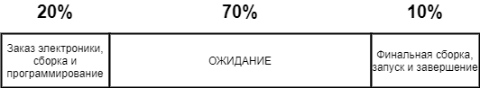

Ожидание... Ожидание служб доставки, ожидание ответа госслужб и, наконец, ожидание весны. Так как никто не хотел искать упавший зонд в ночи. А в регионе запуска (Северо-Запад) зимой темнеет очень рано. Ожидание съело 70% времени. Всегда закладывайте побольше времени в этот сегмент. Ну что я вам рассказываю? Все тут не первый день на IT женаты ;-)

Несмотря на довольно большую задержку, нам удалось довести проект до успешного (!) завершения и сейчас я расскажу вам - как?

## Список оборудования и компонентов

А начнем мы со списка используемого оборудования. В этом списке ссылки даны на сайты, где это можно купить. Не рекламы ради, а референса и облегчения поиска для:

1. [Raspberry Pi 4 Model B](https://www.raspberrypi.org/products/raspberry-pi-4-model-b/)
2. [SPOT Trace GPS Tracker](https://www.findmespot.com/en-us/products-services/spot-trace)
3. [Шар-зонд](https://airblower.ru/)
4. [Фал (канат)](http://nearspace.ru/)
5. [Парашют](http://nearspace.ru/)
6. [Гелий](https://geliy24.ru/)
7. GoPro 7 Black (+Micro SD card 128GB)
8. Powerbank x2 (20000 mah)
9. [RPI Sense Hat](https://www.raspberrypi.org/products/sense-hat/)
10. [LTE GPS HAT - LTE / GPRS / GPS SIM7600E-H - for Raspberry - Waveshare 14952](https://botland.com.pl/en/raspberry-pi-hat-connection/12533-lte-gps-hat-lte-gprs-gps-sim7600e-h-for-raspberry-waveshare-14952.html)
11. [TEMPer Gold USB Temperature Sensor](https://thepihut.com/products/temper-gold-original-usb-temperature-sensor)
12. [RPI Tall Case](https://www.amazon.com/anidees-Aluminum-Extra-Raspberry-Model/dp/B07WWPJZKS?th=1)
13. [RPI Mounting Kit](https://www.reichelt.de/raspberry-pi-abstandshalter-sortiment-m2-5-rpi-mountingkit4-p223625.html?r=1)

Вот из чего состоит наш аппарат. Я не включил в этот список некоторые вещи, такие как материал корпуса полезной нагрузки, дюбели, шланги и т.п, т.к. найти их не проблема и они не требуют особых пояснинений. А теперь пробежимся по пунктам, требующим этого.

### Raspberry Pi 4 Model B

Резонный вопрос: почему не Arduino? Простой ответ - потому что я не умею паять ¯\\_(ツ)_/¯

Вторая причина - я предпочитаю использовать dotnet везде, где это возможно. Но это в меньшей степени повлияло на выбор.

Действительно, если дружите с паяльником - ардуино может стать хорошим выбором. Тем более я видел пару схожих проектов где он успешно используется. А вот в моем случае, неумение паять стало причиной выбора USB термометра с весьма скромным диапазоном измерения (и это отразилось на результатах, о них в конце).

### SPOT Trace GPS Tracker

Вся затея будет считаться даже не начатой, если после того как ваш шарик улетит, вы не сможете его найти. Так что к технике поиска стоит подойти **максимально ответственно.** 
GPS трекеров существует уйма, а этот пожалуй один из самых дорогих (во всяком случае из тех что мне встречались). 

В чем проблема большинства трекеров, которыми завален любой радиорынок? Давайте подумаем: GPS трекер получает свои координаты с помощь GPS спутников (ну еще компенсирует погрешность по наземным станциям) - это замечательно, спутники покрывают всю поверхность Земли. Также очень замечательно, что наш трекер будет знать **своё** местоположение. Но нас то рядом с трекером не будет! Как он должен передать свои координаты в наш ЦУП? Самое массовое решение - GSM сети. Иначе говоря - покупаете симку, вставляете в трекер и он шлет вам смс-ки (ммс-ки, или стикеры в телегу, не важно). Я видел примеры успешных запусков с таким подходом. Но если честно, я пару раз выезжал за пределы КАД и готов вас уверить - во многих местах сотовой связи **нет совсем!** Если наш зонд упадет в такой зоне - провал операции, начинай сначала.

А вот сабж, в отличие от, для передачи координат использует **спутниковый канал связи** со 100% покрытием. Не буду наседать с рекламой, т.к. удовольствие это не дешевое, да еще и требует платной подписки, равной стоимости самого трекера, но отмечу - раз вы читаете эту статью, значит свою функцию он выполнил. Хотя и дал нам понервничать. Но об этом в разделе про поиск и спасение.

Так что еще раз - отнеситесь к выбору поискового трекера максимально ответственно!

### Шар-зонд

Максимально просто - чем больше, тем выше полетит. Мы оперировали примерами успешных запусков из интернета. Там ребята часто использовали шары диаметром 2.5м. В конторе, где мы заказывали свои, нас тоже уверили, что этот - долетит. Немного не долетел, но мы склонны считать, что это не вина шара. Об этом в разделе про результаты.

### Фал (канат)

Канат. Это просто тонкий канат. Заказывали у ребят по ссылке, но могли бы и купить в любом магазине за углом.

### Парашют

Парашют бесстропный. Не разбираюсь в парашютах, но обратил внимание, что для таких нужд используют именно их. Его и заказали вместе с фалом.

### Гелий

Остановлюсь только на факте, что количество гелия (как минимум которое надо купить), придется посчитать для своего объема шара. Вы без проблем вспомните эти школьные формулы или найдете онлайн калькулятор. Но, для истории, приведу их и тут.

Количество стандартных баллонов по 40л которое нам понадобится мы считали так:

$B = V_s\div V_h$

Где $V_s$ - объем шара в $м^3$, $V_h$ - объем гелия при давлении 1атм в $м^3$

$V_s = 4\div3 * \pi * (D\div2)^3$

$V_h = V_b * P_b$

Где $D$ - диаметр шара в метрах.

$V_b$ - объем баллона в $м^3$. Мы взяли его равным $40\div1000$. Где 40 - это известный объем баллона в литрах.

$P_b$ - известное давление в баллоне в атмосферах. 

В нашем случае, необходимое количество баллонов по 40л получилось равным **1.36 баллона**.

Фух, надеюсь ничего не напутал пока переносил формулы из Excel.

### RPI Sense Hat

Для любителей RPI это довольно известная вещь. Вкратце поясню - это сенсорный мультитул для RPI. Имеет на борту следующее:
- Датчик температуры (2 штуки)
- Датчик давления
- Датчик влажности
- Гироскоп
- Магнетометр
- Компас
- Акселерометр
- LED дисплей

То что надо в одном флаконе.

### LTE GPS HAT - LTE / GPRS / GPS SIM7600E-H - for Raspberry - Waveshare 14952

Еще одна спорная штука. Нет, вне сомнения, та часть функциональности, которую мы использовали нам очень нужна и она работает отлично. Но, возможно, это overkill и можно найти вариант подешевле.

А использовали мы ее только для показаний GPS (даже без GSM). Дело в том, что трекер то у нас есть (поисковый, не подключается к RPI), но хотелось бы еще к чему-то привязать телеметрию. И, желательно, привязать ее к координатам и времени. Из-за этого и появился еще 1 трекер, но уже подключенный к RPI. Показания с него (координаты, время, курс, скорость, высота) пишутся в лог и служат точкой синхронизации с показаниями всех сенсоров.

Его достоинство - он имеет выносную антенну. А это очень важно, когда на борту 2 приемника GPS и 1 передатчик (поисковый трекер). Производители Spot Trace советуют размещать их трекер на расстонии не меньше 30см от других GPS устройств, во избежание помех. Так что тут пригодилась выносная антенна, которую мы просто кинули за борт.

Его недостаток - документация в лучших китайских традициях. Ее сначала пришлось поискать, а потом еще и нехило так покурить (но, вцелом, она весьма исчерпывающая и понятная). Чтобы облегчить поиск будущим начинателям этой борьбы, оставлю ссылки тут (на одном из файлов стоит гриф COMFIDENTIAL (орфография сохранена), лол): [раз](https://www.waveshare.com/w/upload/5/54/SIM7500_SIM7600_Series_AT_Command_Manual_V1.08.pdf), [два](https://www.waveshare.com/w/upload/6/6d/SIM7600E-H-4G-HAT-Manual-EN.pdf).

### TEMPer Gold USB Temperature Sensor

Внешний градусник (для замера температуры внутри использовали Sense Hat).

Его достоинства: он подключается в порт USB, есть рабочий тулсет для проверки (под Win)

Его недостатки: нижний предел измерения $-40^oC$. Сразу скажу - этого оказалось маловато; второй недостаток - документация. Ее нет. Пришлось ренимировать проекты 5-летней давности под *похожие* модели и написанные на разных языках. В итоге поскрещивал ежа с ужом и немного поколдовал (тяжела и неказиста жизнь простого программиста). Но, в итоге все работает надежно, как швейцарские часы. В разделе с кодом я поясню где был тонкий момент.

### RPI Tall Case

Это крутая штука, которая доставляет мне эстетическое удовольствие.

Красивый, алюминиевый, высокий кейс для RPI 4. Разумеется, перед заказом и прикинул высоту RPI с обеими шапками (Sense + GPS) - чуть-чуть не влезает при плотно закрытой крышке. Но, используя spacers (извините, не знаю русского названия), можно приподнять верхнюю крышку немного, для вентиляции.

Из проблем с ним было только одно - один из разъемов GPS HAT сильно выпирал за границы платы и не влезал в кейс. Разъем пришлось нежно демонтировать кусачками.

Ну только посмотрите, как элитно стал выглядеть наш самописец:

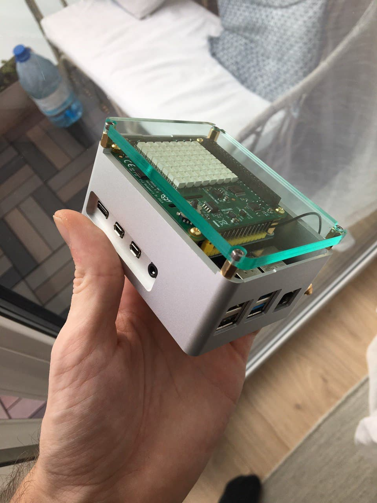
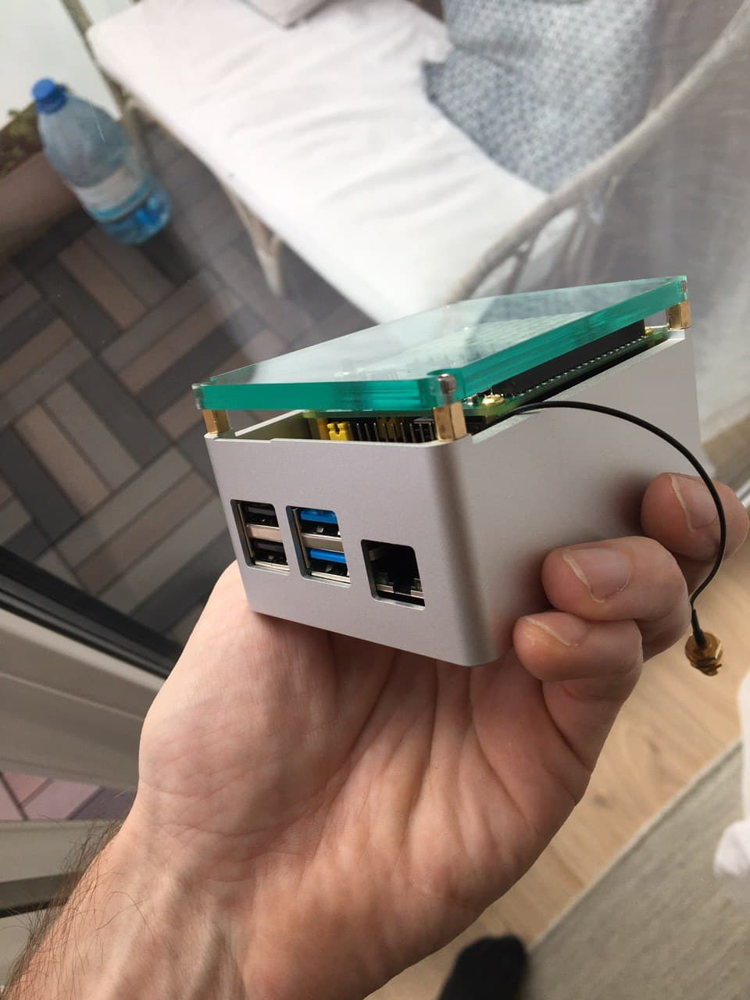
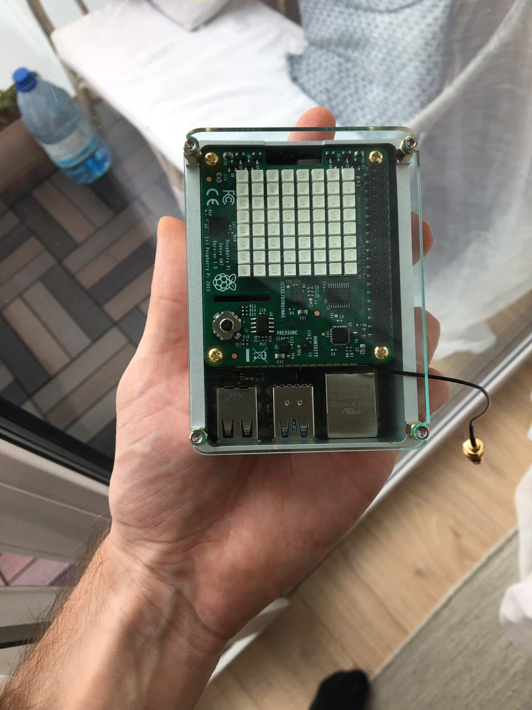

### RPI Mounting Kit

Просто наборчик тех самых spacers и прочих мелочей. Приятное дополнение.

## Конструкция

### Общая конструкция

Для начала рассмотрим общую конструкцию аппарата (масштаб не соблюден!):

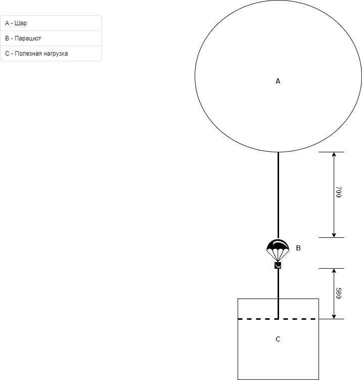

Как вы понимаете, стратосферный зонд это, по факту, шарик (в нашем случае диаметром 2.5м) с полезной нагрузкой на веревке и парашютом. Парашют крепится к нагрузке с помощью вентиляционных отверстий фалом 580мм (подробней в схеме полезной нагрузки). Ну а шар к куполу парашюта тоже фалом (700мм).

Принцип работы прост: с набором высоты атмосферное давление падает и гелий внутри шара начинает этот шар раздувать. В конце концов, шар не выдержит растяжения и лопнет. Нагрузка начинает падать и от набегающего потока воздуха раскрывается парашют. На парашюте нагрузка плавненько опускается на землю.

### Полезная нагрузка

Конструкция короба для полезной нагрузки вызывала у меня немного больше переживаний. Требовалось соблюсти несколько очень важных условий:
1. Предельная масса не более 2.5кг (для нашего объема шара)
2. Защита от воды + плавучесть (облака, дождь, падение в озеро и т.п.)
3. Хорошая терморегуляция (RPI не должна перегреться, а аккумуляторы не должны замерзнуть)

Посовещавшись с нашим конструкторсим бюро, было решено делать куб со стороной 250мм из экструдированного пенополистирола (куплен в строительном магазине листами). Верхняя крышка двустворчатая из того же материала. В боковой стенке вырезано отверстие под объектив GoPro. Он легкий, имеет положительную плавучесть, достаточно прочный и не пропускает воду (швы, разумеется, проклеели):

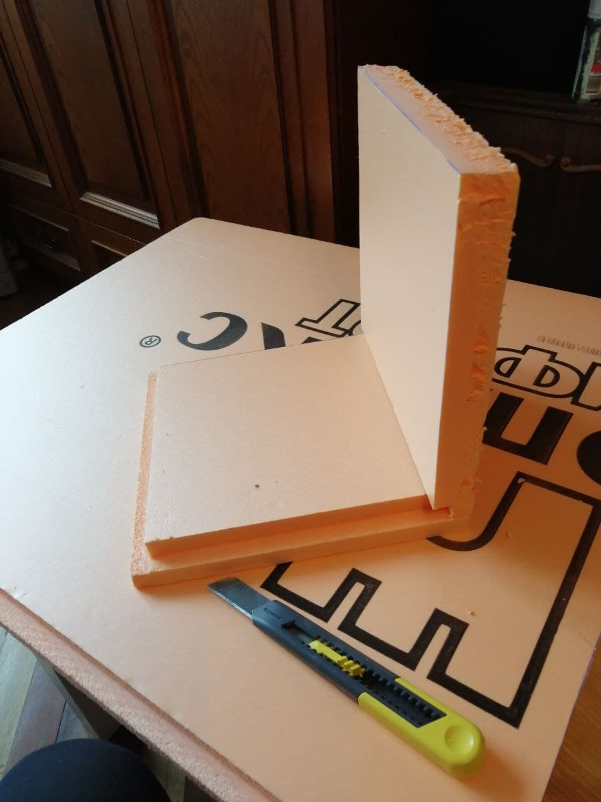
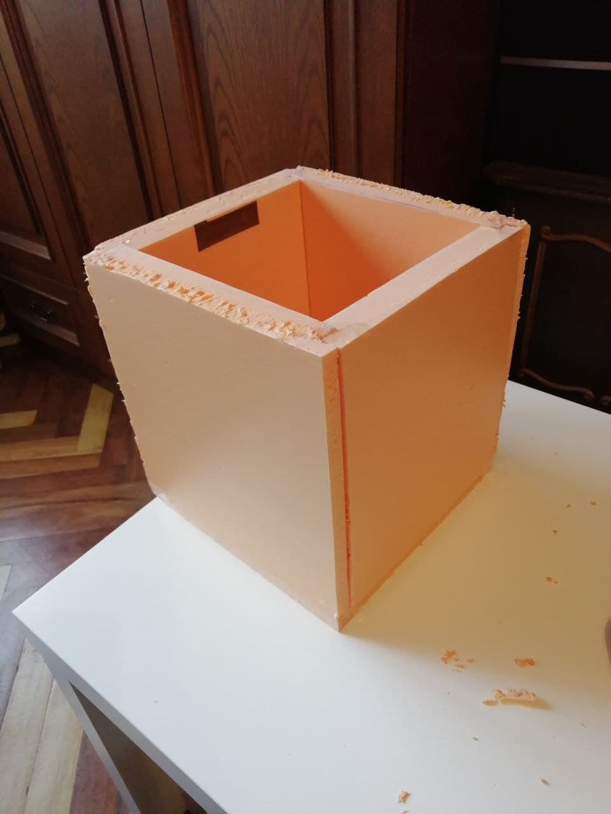

Теперь рассмотрим компоновку компонентов. Как я сказал, тут главная проблема - терморегуляция. Честно говоря - я не инженер (хотя в дипломе такое слово написано). Так что за правильность решения не ручаюсь, но общими усилиями мы родили такую идею:

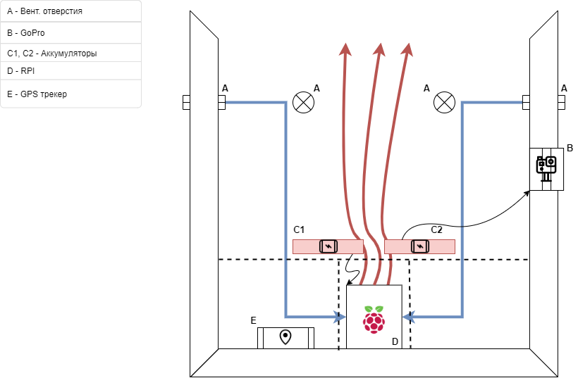

> Обратите внимание, что это схема без развесовки. Сбалансируйте компоненты так, чтобы короб не перекашивало в подвешенном состоянии. Мы это делали методом проб и ошибок.

RPI располагается внизу. Забортный воздух поступает через вент. отверстия (дюбели, 8 штук) в короб и опускается к RPI. RPI выделяет тепло в процессе своей работы и нагретый воздух поднимается вверх. Тем самым подогревая аккумуляторы, расположенные над RPI. GPS трекер имеет собственное питание и довольно неприхотлив к внешним условиям (водонепроницаем, ударопрочен, низкое энергопотребление), так что за него голова не болела. Докучи, мы еще загерметизировали соединения с камерой и внешним градусником (обычным клеем залили), т.к. ожидали образование конденсата.

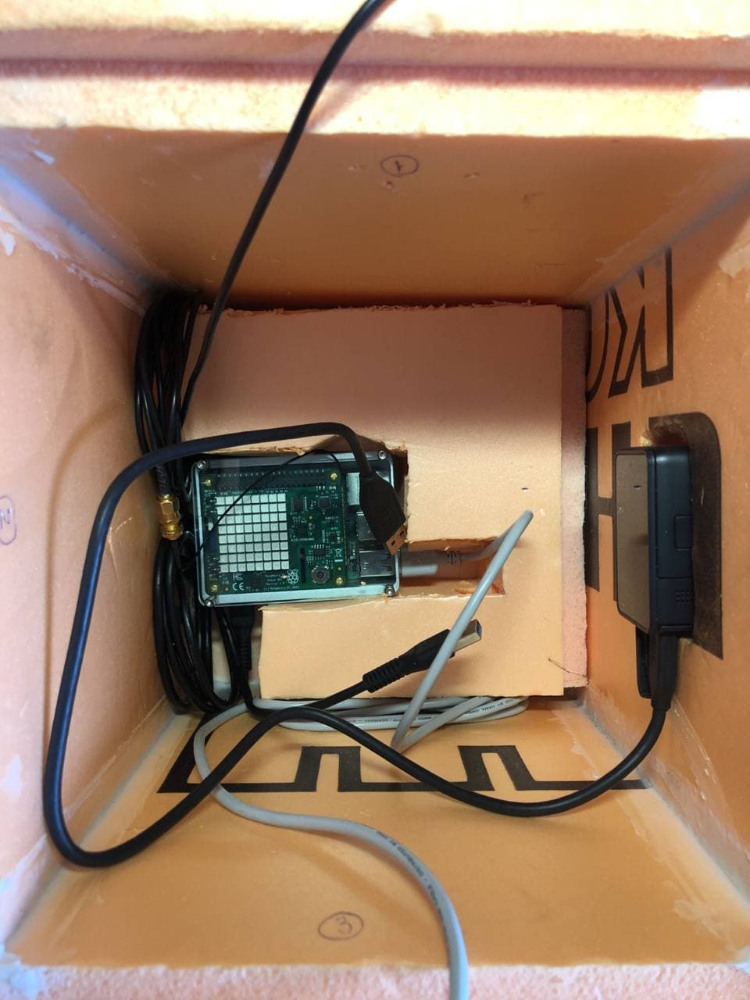

Вент. отверстия также используются для крепления фала от парашюта:


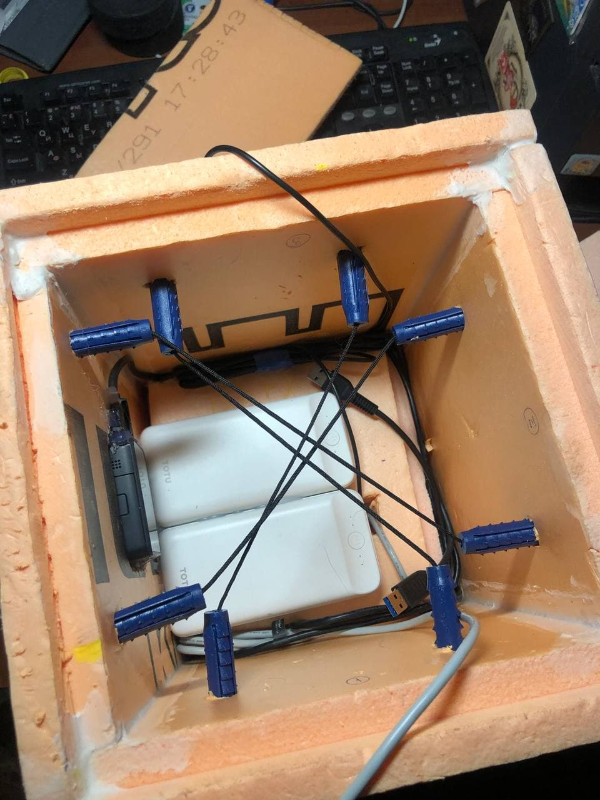


## Конфигурация Raspberry PI 4B

Сам по себе не представляет никаких проблем, все очень просто и понятно. Это мини-компьютер с портами ввода-вывода к которым мы, в дальнейшем, планируем подключать все наши датчики\сенсоры\велотренажеры.

Скачать [Raspberry PI Imager](https://www.raspberrypi.org/downloads/), выбрать нужную OS, свою SD карту и нажать WRITE:

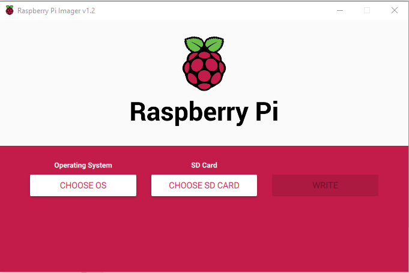

OS было решено взять максимально облегченную. Десктоп и рюшечки нам не нужны, только консоль, только хардкор 👿 Выбор пал на Raspberry PI OS Lite 32-bit:

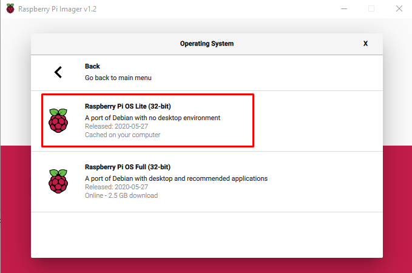

### SD карта для Raspberry PI

Хоть в [официальной документации](https://www.raspberrypi.org/documentation/installation/sd-cards.md) толком и не указан максимально допустимый объем карты памяти с которой RPI сможет загрузиться (но указан минимальный - 16GB и, как-то намеками указана возможность загрузки с 256GB с определенного дистрибутива), быстрый гугл показал, что лучше взять 32GB. На этом и остановились. Класс карты не сильно критичен, но разница в цене между Class 4 и Class 10 мне показалась не критичной, так что почему бы не взять ту, что побыстрее? Тем более что это, в дальнейшем, открывает возможность скидывать поток видео с GoPro на карту. Но до этой реализации мы не дошли и, честно говоря, я пока не придумал зачем это надо. Карту взяли **SanDisk Extreme 32GB** типа [такой](https://www.amazon.co.uk/dp/B06XWMQ81P?tag=androcentr-21&ascsubtag=UUacUdUnU77910YYwYg)

### Подключаем RPI к компу

После того как OS записана на карту и карта вставлена в слот на RPI, можно включить RPI просто подав на него питание. Питается это чудо через порт USB-C, так что озаботьтесь проводом заранее (я использовал 1 из повербанков).

Тут у нас первая проблема: ну включили, лампочки замигали, вроде все ОК. 
> И что?

Да, операционку то мы поставили без десктопной оболочки, да и мониторы с клавиатурами мы подключать не планировали, и Wi-Fi там еще не настроен.
Так что я немного присел на стул на полчаса. 

(╯°□°）╯︵ ┻━┻

Честно говоря, бежать в магазин за проводом\переходником mini HDMI у меня не было никакого желания. Снова запускаем гугол и видим, что ситуаци не безвыходная: можно подключить RPI к компу через USB и через него же наладить SSH. И, хотя тот же гугол говорит обратное, RPI при этом будет и питаться от компа и эмулировать сетевое соединение **через один и тот же USB кабель**. Нуштош, вытыкаем наш кабель из павербанка и подлючаем его в USB компа. Снова замигали лампочки, RPI загрузился и, судя по статусу лампочек - у него все отлично.

Но по SSH все еще не подключиться. Курим [вот эту страницу](https://www.raspberrypi.org/documentation/remote-access/ssh/). Нас интересует *headless mode*:

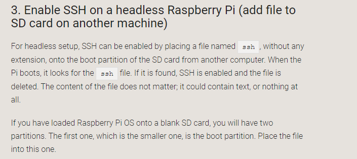

Ага, надо поместить пустой файл с именем `ssh` в корень SD карты. Извлекаем карту из RPI и вставляем ее в комп (предварительно обесточив устройство). Делаем. Пробуем снова. Hostname, User, Password указаны там же, в подразделах для каждой OS. Но, честно говоря, информация там немного устаревшая. Например для Win10 указано, что надо использовать IP вместо имени хоста. Это не так. Забегая вперед, скажу, что и `hostname: raspberrypi.local` тоже заработал без приключений. 

>Интернеты пишут, что для этого необходимо поставить доп. приблуды от Apple, чуть ли не iTunes. Либо опенсорс аналог драйвера для таких доменных имен. Но, как я уже сказал, у меня все заработало и без вот этих вот дел. На всякий случай, вот подробная [статья](https://www.howtogeek.com/167190/how-and-why-to-assign-the-.local-domain-to-your-raspberry-pi/)

Итого. Что мы имеем по подключению по SSH:

`Hostname: raspberrypi.local`

`User: pi`

`Password: raspberry`

Пробуем... не работает. К сожалению у меня не сохранились все скрины этих приключений, ну да ладно, придется поверить мне на слово - не работает.

(╯°□°）╯︵ ┻━┻

Переходим на *нижние интернеты*... Оказывается, мы забыли включить режим **Lan Over Usb** про который я что-то не нашел упоминания в документации (в итоге на офф форумах это им припоминали). Искомая статья (может не именно она, но шаги в ней описаны верные) - [тут](https://learn.adafruit.com/turning-your-raspberry-pi-zero-into-a-usb-gadget/ethernet-gadget)

Итак, если вкратце, нам нужно будет поменять 2 файла на SD карте: `config.txt && cmdline.txt` (могут быть без расширений, я уже не помню). Вынимаем карту из RPI, подключаем к компу, находим первый файл и добавляем в конце строчку `dtoverlay=dwc2`:

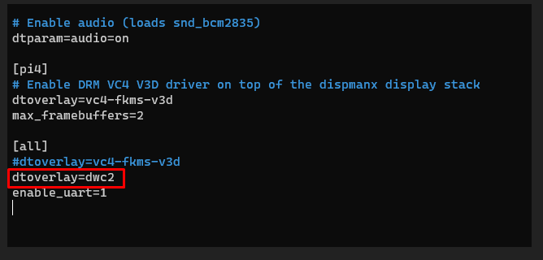

Теперь ищем второй файл (`cmdline.txt`). 
>По поводу второго файла небольшое отступление - мне его менять не пришлось - и так все было как надо. Но мало ли ¯\\__(ツ)_/¯ 

Добавляем в него строчку, указывающую на необходимость загрузки нужного модуля ядра (все параметры идут через пробел в одну строчку, это важно!). Скрин из статьи:

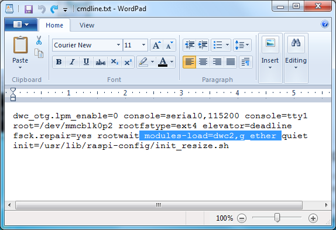

Всё, файлы сохранили, карту вставили обратно в RPI, подключаем USB кабель в комп и в порт питания RPI, RPI загружается. Пробуем SSH:
```sh
ssh pi@rasberrypi.local
```

(да, кстати, озаботьтесь наличием SSH клиента на рабочем компе, если вдруг у вас его еще нет)

На этот раз все должно пройти как по маслу (извините, этого скрина тоже не сохранилось). Мы попадем в bash консоль на нашей Raspberry PI 4B по USB и теперь можем наворотить там дел ;-) А первое дело будет - обеспечить себе максимально удобные условия работы, иначе говоря - Wi-Fi!

#### Включаем Wi-Fi на RPI

Тут совсем все просто и без неожиданностей. В RPI OS входит утилита конфигурации через которую можно сделать все (или почти все) что может понадобиться в дальнейшем. Называется она `raspi-config` и ее использование, в частности в контексте настройки *вафли* неплохо описано в официальной документации - [тут](https://www.raspberrypi.org/documentation/configuration/wireless/wireless-cli.md).

Подключаемся по кабелю в SSH сессию нашего *черного ящика*, запускем из консоли:
```sh
sudo raspi-config
```

Всего несколько клацаний кнопками и можно отсоединять наш USB кабель от компа и подключать его к павербанку (картинки из интернета):

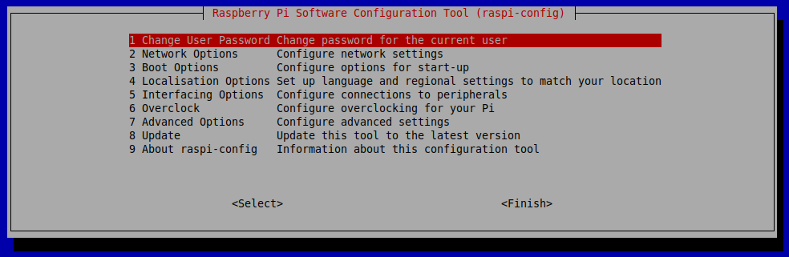

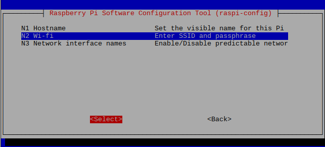

Ну что же, теперь это гораздо больше похоже на независимый бортовой самописец для стратостата, хоть он пока ничего и не самопишет.
> Для удобвства также советую добавить SSH ключи. Надеюсь не надо объяснять как это делать, но если вдруг, то [вот отличный тутор от DigitalOcean](https://www.digitalocean.com/community/tutorials/how-to-set-up-ssh-keys--2) 

### Сборка .NET Core проекта под RPI

> Небольшое отступление: вся возня с RPI, периферией и написание софта делалось почти год назад. Много информации с тех пор утекло из моей головы и сейчас я эту часть пытаюсь восстанавливать по памяти. К сожалению, восстановить 100% этого приключения у меня не получится, но общие моменты я обозначу.

Настало время что-нибудь напрограммировать для нашего самописца. Сейчас, прочитав этот подзаголовок, многие могут подумать:


>А почему не питон??

Ну... по нескольким причинам. Во-первых: хваленое комьюнити которое "уже все давно написало, просто подключай и поехали", оказывается не всё написало, а то, что написало, мягко скажем - не едет (об этом в разделе про внешний градусник). А во-вторых: что-бы я не начинал писать - все равно получается C#.

Так что стереотипы прочь - будем ваять *простенький скрипт на шарпе* (зря нам что ли кроссплатформу завозили)! Я буду показывать всё на примере своего проекта для логирования всех показателей. Кто захочет - может использовать свой "hello world", кто не захочет - вот [исходники на гитхабе](https://github.com/ArtemKiyashko/RpiProbeLogger) 

Бытует мнение, что для того, что-бы завести что-то на dotnet, надо для начала этот самый dotnet установить. На самом деле это не так. Dotnet умеет паковать свой CLR в приложение для целевой платформы. Для этого у dotnet cli есть флаг `--self-contained`. Так же нам потребуется указать какой конкретно рантайм мы будем использовать при помощи параметра `-r linux-arm`. Ну и фреймворк укажем, чего уж там. Итого полная команда для сборки самодостаточного dotnet приложения (не требующего установки dotnet runtime на целевую машину) будет выглядеть так:
```ps
dotnet publish RpiProbeLogger\RpiProbeLogger.csproj --self-contained -r linux-arm -f netcoreapp3.1 -c Release
```

На выходе у нас получится исполняемый файл под linux arm со всеми зависимостями. Нам останется только скопировать все содерижимое директории на Raspberry по SSH, сделать файл исполняемым (не обязательно) и, собственно, запустить (подробнее в разделе про CI/CD):
```sh
chmod +x /home/pi/RpiProbeLogger/RpiProbeLogger
./home/pi/RpiProbeLogger/RpiProbeLogger
```

Если кто-то крутит носом от self-contained приложений - ничего страшного, вариант с установкой рантайма и фреймворка (ну мало ли кто-то захочет еще и билдить на распберри) на RPI тоже допустим и прекрасно работает - проверено! Вот [статья](https://edi.wang/post/2019/9/29/setup-net-core-30-runtime-and-sdk-on-raspberry-pi-4) которую я лично использовал (в ходе экспериментов).

## CI/CD для Raspberry

Немного громкое название, но смысл тот-же - приложения мы писать умеем, надо теперь их собирать под целевую платформу и как-то их туда доставлять. Тут нам поможет его величество PowerShell (linux-like товарищи легко заменять его на bash, sh, etc по вкусу. это не принципиально).

Весь скрипт находится в корне репозитория и называется `buildAndDeploy.ps1`. Общий алгоритм такой:

1. Подключиться к RPI по SSH для выполнения команд
2. Установить SFTP сессию для работы с файлами
3. Собрать наше приложение
4. Скопировать билд на RPI
5. Установить и включить сервис нашего приложения (что-бы запускался автоматически при загрузке RPI)

### SSH

Поехали по очереди: с **SSH/SFTP** нам сильно поможет модуль для Powershell - [Posh-SSH](https://github.com/darkoperator/Posh-SSH). На мой взгляд с этим модулем все хорошо, кроме одного - почему-то документацию по нему приходится искать по всему интернету и собирать по крупинкам. Может автор посчитал, что его API и ежу понятно, но вот мне было не очень понятно. Примеры использоввания с описаниями нашлись [тут](https://www.powershellmagazine.com/2014/07/03/posh-ssh-open-source-ssh-powershell-module/). Нас же сейчас инересует установка SSH сессии и делается она вот так:
```ps
$sshSession = New-SSHSession -Computer raspberrypi.local -Credential $credentials -KeyFile $rsaKeyFile
```

Сама сессия сохраняется в переменную `$sshSession`. Обратите внимаение на 2 переменные: `$credentials` и `$rsaKeyFile`: мы же не хотим использовать ~~привет из 90-х~~ пароли? Мы будем использовать RSA ключи! И как это делать в случае Posh-SSH мне пиршлось поискать. Сначала объясню немного про креденшиалс - в Powershell есть такой командлет `Get-Credential` - он занимается тем, что нативными средствами запрашивает пару логин-пароль у пользователя и возвращает их в качестве объекта:
```ps
$credentials = (Get-Credential pi)
```

В Win10 это выглядит так:

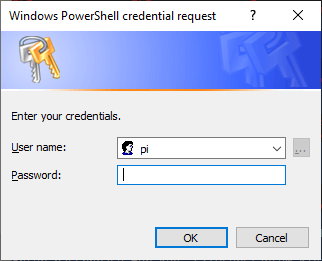

Как вы уже догадались, первым параметром можно сделать пре-ввод логина - pi. Нам это подходит. Теперь тонкий момент про Posh-SSH: он имеет параметр `-KeyFile` куда передается путь до приватного SSH ключа. НО! Приватный ключ может иметь passphrase - а такого параметра Posh-SSH не имеет. Оказывается, и это пришлось поискать, Posh-SSH будет в качестве passphrase использовать пароль из объекта `$credentials` - и это не слишком очевидное поведение, но именно из-за этого и затевалось использование `Get-Credential`. Чтож, этого вполне достаточно, чтобы подключиться по SSH к RPI. Полный скрипт находится в репозитории, а мы двигаемся дальше.

### SFTP

Никаких откровений тут не скрыто, тот же Posh-SSH, те же Credentials, немного другое имя команды:
```ps
$sftpSession = New-SFTPSession -Computer raspberrypi.local -Credential $credentials -KeyFile $rsaKeyFile
```

Сразу укажу команду для копирования файлов (да, всего в одну строчку деплоим, без хитростей):
```ps
Set-SFTPFolder -SFTPSession $sftpSession -RemotePath '/home/pi/RpiProbeLogger' -LocalFolder "RpiProbeLogger\bin\$($c)\netcoreapp3.1\linux-arm\publish" -Overwrite
```

Да, называется она `Set-SFTPFolder`, не спрашивайте почему - я не знаю. Можно догадаться, что копирует она содержимое исходной директории в целевую директорию, а параметр `-Overwrite` указывает что содержимое целевой директории будет перезаписано в случае совпадения имен файлов. Параметры `-RemotePath` и `-LocalFolder` ясны без пояснений. Единственное, что может привлечь внимание - `$($c)` - это передача параметра командной строки, который содержит тип сборки: *Release* или *Debug*. Он так же используется в следующем пункте - сборке приложения.

### Сборка

Итак, как уже было описано в разделе про сборку .net под arm - наша команда сборки будет выглядеть следующим образом:

```ps
dotnet publish RpiProbeLogger\RpiProbeLogger.csproj --self-contained -r linux-arm -f netcoreapp3.1 -c $c
```

Единственная разница тут - это параметр `$c` который мы будем подставлять из параметров командной строки (Release, Debug, etc) - на самом деле можно и не параметризовывать это, а захардкодить "Release" - на любителя.

### Включение\запуск сервисов

Все тот же Posh-SSH имеет еще одну полезную команду: `Invoke-SSHCommand`. С помощью нее мы выполним установку `systemctl` сервиса. Unix-like ребятам тут делать нечего, для остальных немного пролью свет что это.

`systemctl` - это системная служба для управления службами (да-да). Она запускается автоматически и запускает, останавливает, управляет пользовательскими службами основываясь на специальных файлах - `.service`. Такой файл присутсвтует и у меня в репозитории в подпапке с проектом - `probelogger.service` и вот его содержимое:

```sh
[Unit]

Description=Probe Logger Service

[Service]

User=root

WorkingDirectory=/home/pi

ExecStart=/home/pi/RpiProbeLogger/RpiProbeLogger

ExecReload=/bin/kill -HUP $MAINPID

KillMode=process

Restart=on-failure

Type=exec

StandardOutput=syslog

StandardError=syslog

SyslogIdentifier=RpiProbeLogger

[Install]

WantedBy=multi-user.target
```

Я не буду врать, говоря что мне тут понятно абсолютно все, но, в основном это читается как-то так: 
1. запускать службу от пользователя `root` (да, секурность - не секурность, я понимаю. но рут привелегии потребовались для чтения данных с порта USB. Об этом позже)
2. рабочая директория - такая-то
3. запускать - тот-то файл
4. для перезапуска сервиса в случае катастрофы использовать команду `kill`
5. перезапускать в случае падения
6. логи сохранять в `syslog`

Далее пара команд Posh-SSH. Включение сервиса (означает что он будет запускаться автоматически при запуске RPI):

```ps
Invoke-SSHCommand -Command 'sudo systemctl enable /home/pi/RpiProbeLogger/probelogger.service' -SSHSession $sshSession
```

Немедленный запуск сервиса (не обязательно же перезапускать RPI для нашего логгера, мы же не драйвера пишем):

```ps
Invoke-SSHCommand -Command 'sudo systemctl start probelogger.service' -SSHSession $sshSession
```

Переменная `$sshSession` нам знакома из раздела про SSH сессию - это именно та самая сессия. Файл `probelogger.service` - в репозитории.

Чтож, на этом пожалуй все, что касается билда и доставки нашего самописца на RPI. Напоминаю, весь powershell-скрипт - в корне репозитория (`buildAndDeploy.ps1`). Не совсем автоматизировано - запускать нужно ручками, но вполне себе "continuous" - билди хоть после каждого коммита. Можно было бы конечно поднять pipeline на основе этого на каком-нибудь Azure DevOps или кто что любит (благо выбор сейчас из десятка платформ присутсвует), но я посчитал это оверкилом для таких задач. Побилдим руками, не сломаемся.

Команда билда и деплоя выглядит вот так:
```ps
.\buildAndDeploy.ps1 -enableService -runService
```

По умолчанию билдится *Debug* версия (нам же для разработки и отладки надо). Можно добавить параметр `-c=Release` если необходимо собрать финальную версию.

## Отладка в Visual Studio

Это та часть, где время стерло бОльшую часть информации. Но поверьте - тут все просто и прозрачно, а на MSDN есть даже статья по отладке кода на RPI для VSCode и Visual Studio - [VS Remote Debug](https://docs.microsoft.com/en-us/dotnet/iot/debugging).

Я опишу буквально в 2-х словах для своего случая (Visual Studio):
1. Открываем окно удленного дебага: `Debug -> Attach to Process`
2. Выбираем Connection Type: `SSH`
3. Вбиваем в поле Connection Target наш `pi@rasberrypi.local`
4. Ищем в списке наш процесс `dotnet` (иногда может потребоваться включить `Show processes from all users`, зависит от вашей конфигурации)
5. Жмем `Attach` и мы в деле!

Breakpoints, Watches, Locals, Immediate Window, Threads - все работает.

## Программирование

Сразу ссылка на репозиторий с исходниками - [GitHub](https://github.com/ArtemKiyashko/RpiProbeLogger)

Я очень долго откладывал этот раздел для написания, т.к. софт был написан год назад и я почти забыл все те ужасы, которые мне пришлось побороть, сражаясь с китайскими комплектующими. Но попробуем хоть что-то наковырять. Сейчас я лишь заменил project reference на nuget package, т.к. зачем-то я скачивал исходники проекта нугет пакета (надеюсь просто так, сейчас солюшен билдится).

Как и в системе "театр-вешалка", dotnet приложение начинается с конфигурации. Конфигурации DI, логгеров и вот этого всего. В нашем случае в функции `Main`:

```cs
static async Task Main(string[] args)
        {
            var host = new HostBuilder()
                .ConfigureServices((hostContext, services) => {
                    services.AddHostedService<RpiProbeHostedService>();
                    services.AddSingleton<SerialPort>((_) => { 
                        var serialPort = new SerialPort("/dev/ttyS0", 115200);
                        serialPort.ReadTimeout = 500;
                        serialPort.WriteTimeout = 500;
                        serialPort.NewLine = "\r";
                        serialPort.Open();
                        return serialPort;
                    });
                    services.AddTransient<GpsModuleStatusCommand>();
                    services.AddTransient<GpsModuleCoordinatesCommand>();
                    services.AddSingleton<RTIMUSettings>((_) => RTIMUSettings.CreateDefault());
                    services.AddSingleton<RTIMU>((provider) => {
                        var muSettings = provider.GetService<RTIMUSettings>();
                        return muSettings.CreateIMU();
                    });
                    services.AddSingleton<RTPressure>((provider) => {
                        var muSettings = provider.GetService<RTIMUSettings>();
                        return muSettings.CreatePressure();
                    });
                    services.AddSingleton<RTHumidity>((provider) => {
                        var muSettings = provider.GetService<RTIMUSettings>();
                        return muSettings.CreateHumidity();
                    });
                    services.AddTransient<SenseService>();
                    services.AddTransient<ReportService>();
                    services.AddSingleton<StatusReportService>();
                    services.AddSingleton<TemperService>();
                })
                .ConfigureLogging(logConfig =>
                {
                    logConfig.SetMinimumLevel(LogLevel.Information);
                    logConfig.AddConsole();
                })
                .Build();
            await host.RunAsync();
        }
```

Как видите, мы пошли путем использования `IHostedService` как основной крутилки нашего логгера, настроили `SerialPort` для доступа к GPS HAT (зачем-то я его инжектю в hosted service, вместо того чтобы использовать там GpsMuduleCommand, очевидно проглядел тогда), добавили наши сервисы для доступа к SenseHat в контейнер DI и настроили логирование в консоль. Тут все - `host.RunAsync()`!

Не буду приводить тут содержимое каждого файла, кому надо - посмотрят на гитхабе. Тут обрисую основную идею. Вся она описана в нашем хостед сервисе `RpiProbeHostedService`. Содержммое метода `StartAsync`:

```cs
public Task StartAsync(CancellationToken cancellationToken)
{
    var gpsStatus = _gpsModuleStatusCommand.GetStatus();
    
    if (gpsStatus?.Enabled == false)
        _gpsModuleStatusCommand.SetStatus(
                new GpsModuleStatusResponse
                {
                    Enabled = true,
                    Mode = GpsModuleModes.Standalone
                });

    while (true)
    {
        if (cancellationToken.IsCancellationRequested)
            return Task.CompletedTask;

        var gpsData = _gpsModuleCoordinatesCommand.GetGpsData();
        if (gpsData != null || _reportService.ReportFileCreated)
        {
            var senseData = _senseService.GetSensorsData();
            var outsideTemperatureResponse = _temperService.ReadTemperature();
            try
            {
                _reportService.WriteReport(senseData, gpsData, outsideTemperatureResponse?.OutsideTemperature);
            }
            catch (Exception ex)
            {
                _logger.LogError(ex, "Error writing report");
            }
        }
        Thread.Sleep(1000);
    }
}
```

Итак, для начала нам нужно узнать в каком состоянии наш GPS HAT. Т.к. тот факт, что он включен - еще не означает, что включен непосредственно GPS модуль. Если GPS выключен - включаем его и идем дальше.

А дальше у нас бесконечный цикл с задержкой в 1с. В первую очередь нам нужны показания GPS - так как это есть точка синхронизации всех данных. Так же, дата из этих показаний используется как имя файла-репорта. Так что нам эти данные прям очень нужны.

Затем собираем данные с SenseHat и внешнего градусника и записываем это все в файл-репорт. Вот и вся не хитрая логика.

С SenseHat проблем не было вообще никаких. А сейчас, при написании статьи, оказалось что с тех пор MS даже добавила его поддержку в свою `iot library`. Тут подробнее - [MSDN](https://docs.microsoft.com/en-us/dotnet/iot/quickstarts/sensehat).

Проблемы, как вы догадались, были с внешним градусником. Я перепробовал с десяток разных проектов на разных языках (Python в их числе). Но ни один не заработал именно с этим градусником. Пару раз было *очень близко*, но видимо моя модель чуть-чуть отличалась и показания отрицательных температур были неверны. Это сейчас, с остывшей головой, я понимаю - если проблема в месте, где присутствует минус - надо смотреть на тип данных. И таки да, замена `byte` на `sbyte` сделала свое дело. Но тогда, год назад, я был на грани отчаяния. Метод `ReadTemperature`:

```cs
public OutsideTemperatureResponse ReadTemperature()
{
    if (!_controlDeviceOpen || !_bulkDeviceOpen)
        OpenDevices();
    var response = new OutsideTemperatureResponse();
    try
    {
        _bulkStream.Write(_tempCommand);
        var rawResult = _bulkStream.Read();

        response.OutsideTemperature = ((rawResult[4] & 0xFF) + ((sbyte)rawResult[3] << 8)) * 0.01;
        _statusReportService.DisplayStatus(response);
        return response;
    }
    catch (Exception ex)
    {
        _logger.LogError("Error reading outside temperature", ex);
        _statusReportService.DisplayStatus(response);
    }
    return null;
}
```

Метод хоть и небольшой, но содержит парочку magic numbers. Знаете где вы найдете их объяснение? Нигде. Это все наковыряно и проверено (методом проб и ошибок) из разных проектов. Так что если у вас такой градусник - поздравляю, ваши страдания окончены.

Не стоит забывать, что наш самописец не подключен к монитору и нам надо бы как-то понимать - все ли на нем работает штатно. Для этих целей я использовал LED матрицу на SenseHat. Она небольшая, всего 8x8, так что выводить туда картинки не получится. Но получится мигать/светить лампочками. Более чем достаточно в столь аскетичном устройстве. Код метода `DisplayStatus`:

```cs
public bool DisplayStatus<T>(T status) where T : IResponse
{
    try
    {
        var currentStatus = _currentStatuses.FirstOrDefault(c => c.Cell.Row == status.StatusPosition.Row
                                                            && c.Cell.Column == status.StatusPosition.Column);
        _currentStatuses.Remove(currentStatus);
        _currentStatuses.Add(new CellColor(status.StatusPosition, statusToColorMapping[status.Status]));
        Show();
        return true;
    }
    catch (Exception ex)
    {
        _logger.LogError(ex, "Error displaying status on LED");
        return false;
    }
}
```

Видим, что я инкапсулировал координаты лампочки, которой надо посветить, в класс ответа от конкретной функции (GPS ответ, Sense ответ, ответ от внешнего градусника и т.п.). Все эти response реализуют интерфейс `IResponse`:

```cs
public interface IResponse
{
    public bool Status { get; }
    public Cell StatusPosition { get; }
}
```

Соответственно, обязаны предоставлять статус в формате "Успех\провал" и координаты ячейки LED куда его поместить, и делают это *на свое усмотрение*. Не буду говорить что это идеальный дизайн, но, как минимум год назад, мне он показался *подходящим*. Вот, например, как реализует свой статус ответ от SenseHat:

```cs
[Ignore]
public bool Status => FusionPose.HasValue &&
                        FusionQPose.HasValue &&
                        Gyro.HasValue &&
                        Accel.HasValue &&
                        Compass.HasValue &&
                        Pressure.HasValue &&
                        PressureTemperature.HasValue &&
                        Humidity.HasValue &&
                        HumidityTemperature.HasValue;

[Ignore]
public Cell StatusPosition => new Cell(0,2);
```

Итого у нас есть 5 подсистем:
1. GPS модуль: вкл\выкл
2. GPS модуль: координаты получены и прочитаны
3. SenseHat
4. Внешний градусник: показания есть\нет
5. Лог-файл: координаты имеются\нет
   
Таким образом, маркером для нас, что мы готовы к запуску, будет служить 5 зеленых индикаторов на матрице. 

GPS HAT тоже не вызвал особых проблем, насколько я помню. За исключением новости (для меня), что для работы с `SerialPort` нужны привелегии `root` и его ответ пришлось немного попарсить:

```cs
private string[] ParseCoordinatesResponse(string rawResponse) =>
    rawResponse
        .Split(Environment.NewLine)
        .FirstOrDefault(s => s.StartsWith("+CGNSSINFO:"))?
        .Replace("\r", "")
        .Replace("+CGNSSINFO:", "")
        .Trim()
        .Split(',');

private GpsModuleResponse FormatResponse(string[] parsedResponse) =>
    new GpsModuleResponse {
        Latitude = $"{parsedResponse[5]}{double.Parse(parsedResponse[4]) / 100}",
        Longitude = $"{parsedResponse[7]}{double.Parse(parsedResponse[6]) / 100}",
        DateTimeUtc = DateTime.ParseExact($"{parsedResponse[8]} {parsedResponse[9]}", "ddMMyy HHmmss.f", null),
        Altitude = double.Parse(parsedResponse[10]),
        Speed = double.Parse(parsedResponse[11]),
        Course = double.Parse(parsedResponse[12])
};
```

Положение всех компонентов ответа указано в документации.

>`Еще 1 момент - EventBased подход я решил не использовать, но он вроде работает и методы для него (DataReceived) остались в коде. Честно говоря, не помню почему я так решил, но думаю причины были.`

Перейдем к финансам.

## Бухгалтерия

Быстренько пробежимся по моей не любимой части - сколько все это чудо стоит. В этот манускрипт не попали: стоимость камеры (она у меня уже на тот момент и так была), стоимость спасения и всякая мелочевка, типа клея и винтиков. Эти позиции сильно субъективны.

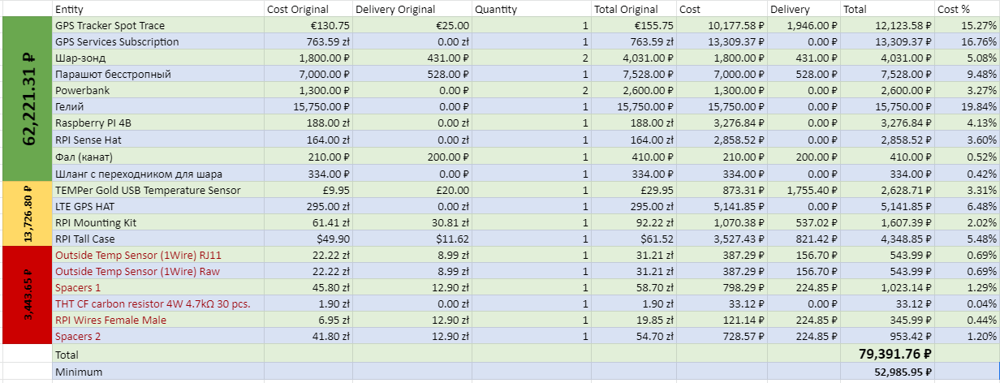

Внизу 2 суммы: одна за все позиции, вторая (Minimum) - это только если запускать одну камеру - без RPI и всего с ней связанного. Как видите, поисковый трекер вместе с подпиской занимают ~30% цены всего аппарата. Так что если найдете вариант подешевле - это хороший повод сэкономить.

Также, в процессе моих экспериментов, я накупил много лишнего - это красная секция в табличке. Это то, что совсем не пригодилось. Желтая секция - это то, без чего *можно было бы* обойтись. Эдакая *ни вам, ни нам середина*. Запуск только лишь зеленой секции означает запуск только камеры и RPI с Sense Hat. Мы запускали зеленую + желтую.

Конечно тут есть простор для оптимизации. Например, я считаю, что вместо GPS HAT можно было бы найти что-то подешевле, за парашют мы тоже явно переплатили, карту памяти для RPI можно смело брать 16Гб (а то и меньше), ну и так далее. Но это все было в первый раз, хотелось подстраховаться - отсюда и цена соответствующая.

## Подготовка к запуску

Прежде всего надо понять - где запускать? Если вы житель мегаполиса, у меня для вас плохие новости - нигде. Ладно шучу, не все так плохо =)

Главное - надо никому не мешать. Рядом не должно быть ни воздушных трасс, ни аэродромов, ни запретных или бесполетных зон. Выбирать место надо с учетом предполагаемой траектории движения (которая зависит от ветра и вертикальной скорости аппарата).

Для этого можно воспользоваться сервисом [FPLN](https://fpln.ru/): включаем в настройках показ всего что нам нужно и ищем глазами свободное место. Вот чисто для примера такое (в зависимости от предполагаемой траектории):

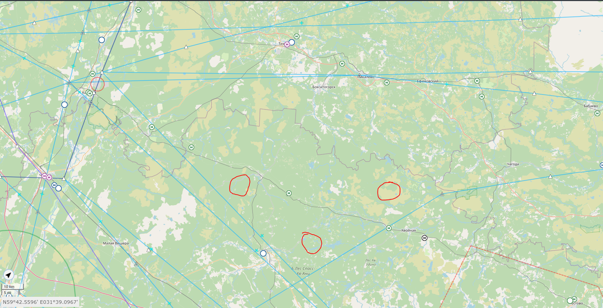

Откуда нам взять предполагаемую траекторию? Тоже есть сервис. [CUSF Landing Predictor 2.5](http://predict.habhub.org/). Вбиваем наши варианты и параметры и смотрим что будет:

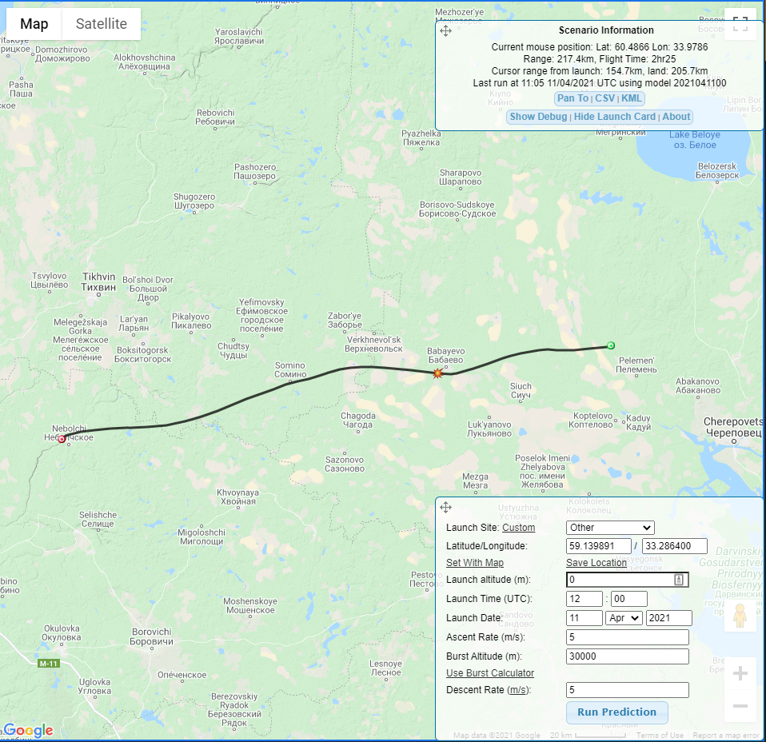

Совмещаем картинку с FPLN и смотрим - подходит/не подходи? Если нет - ищем новое место, если да - поздравляю.

> Для прогнозирования ветра можно использовать [Windy](https://www.windy.com/). CUSF Landing Predictor так же учитывает направление и силу ветра на выбранное время и координаты. ТКак вспомогательное средство, можно использовать [FlightRadar](https://www.flightradar24.com/) чтобы помониторить в реальном времени самолеты в предполагаемом районе запуска.

Ну что. Если вы дошли до этого этапа, значит бОльшая часть пути позади. Впереди запуск!

## Запуск
Со слов участников: Выбрали точку, заправили тарантас, взяли пару баллонов гелия и двинули на место. Описывать тут особо нечего. Имейте только ввиду - шар такого размера с гелием имеет неплохую подъемную силу! Так что придерживайте его пока будете надувать (а лучше привяжите временно).

В этой операции использовались:
1. Клапан Голубева
2. Переходник под него
3. Шланг
4. Переходник со шланга на баллон 3/4 дюйма


Просто вставлю пару фото, чтобы дать понять масштабы:

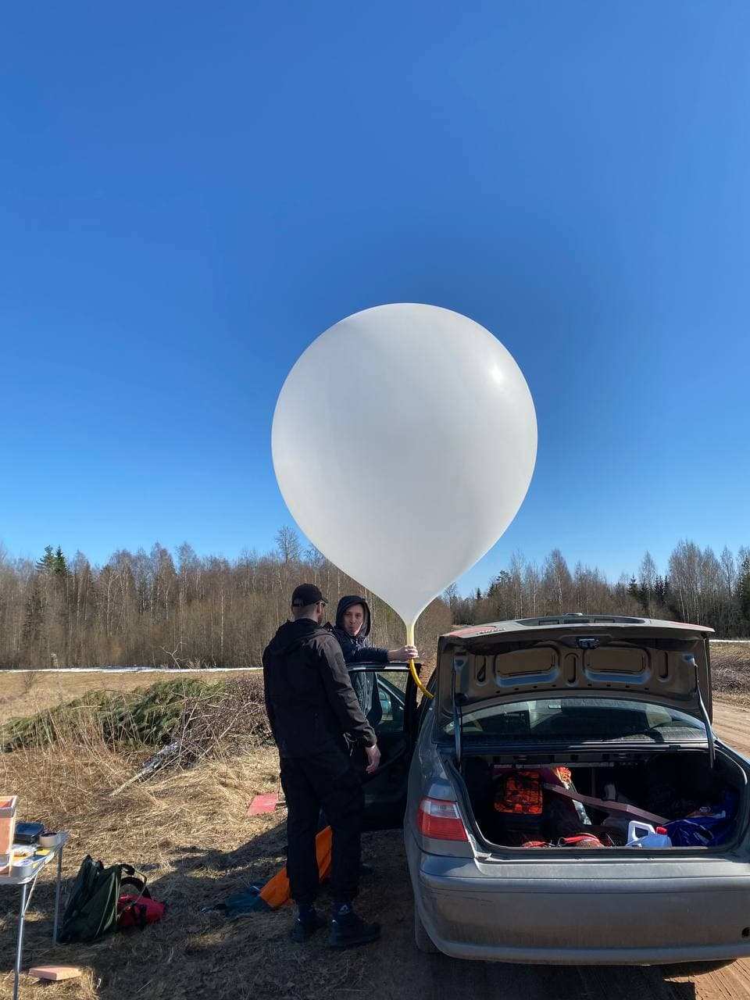
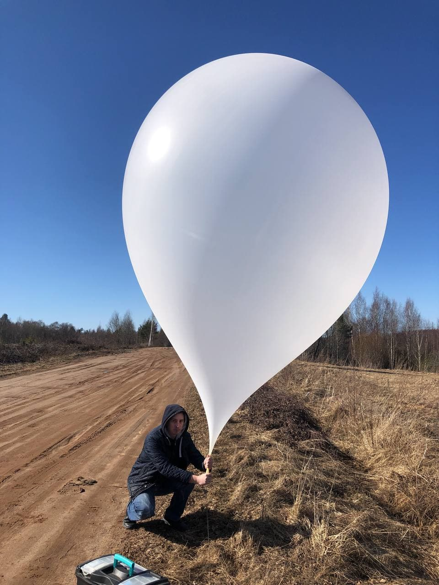

**Убедитесь что GPS трекер включен!** Без него - вся эта затея будет провалена сразу после запуска. Далее подключаем питание к RPI и GoPro. Ждем успешный статус на RPI, включаем запись видео на камере, запаковываем короб, крепим к парашютному фалу, парашют к шару и... Поехали!

## Поиск и спасение
Ооооо, это был самый волнительный и насыщенный этап! Как только аппарат оторвался от земли (а точнее от рук) я, как оператор ЦУП, затаился в ожидании первых координат от поискового трекера.

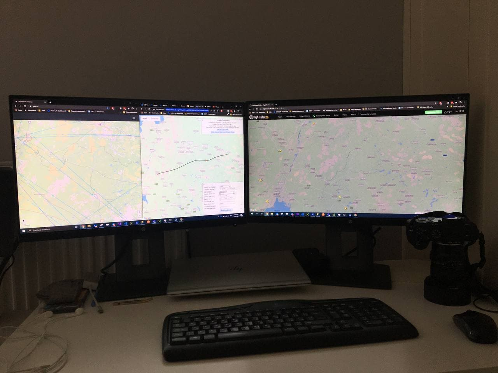

И первый трек не заставил себя долго ждать. Приведу сразу весь маршрут, полученный с поискового трекера и давайте немного его обсудим:

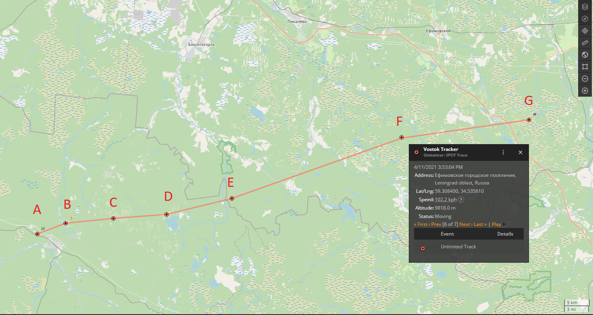

Расстояние между конечными точками ~100км. Хотя расчетное было около 200км. Наш зонд *немного* не долетел. Но с этим разберемся в результатах.

Наивысшая точка (F) по этим показаниям - 9800м. Дело в том, что у нашего поискового трекера предел измерения высоты - 10км. Так что это еще не значит, что зонд выше не поднимался, нет. Просто после этой точки он... пропал! Я, разумеется, ожидал этого и ждал, и ждал, и ждал. Ну сколько он может там летать над 10км? Ну час, ну максимум 2. Учитывая, что расчетное время всего полета было 2ч 25мин. Но обратите внимание на дату и время в этой точке (верхняя часть):

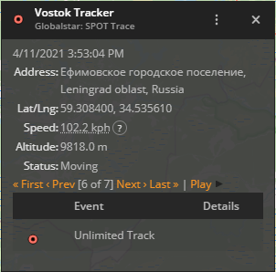

А теперь взглянем на *следующую* точку - G:

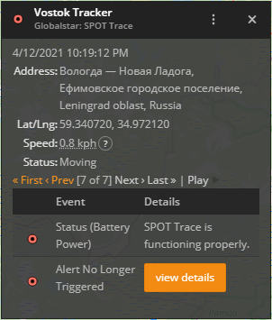

Где тебя носило больше суток ( ´･･)ﾉ(._.`)?! Я ~~все морги-больницы обзвонил~~ все это время не спал и мониторил показания (да что уж там - все мониторили). Но, видимо, условия для передачи сигнала были не благоприятные. Хорошо что запас автономности у этого трекера очень хороший - он до сих пор передает координаты на тех же аккумах. Ок, в итоге нашелся, посмотрим где упал?

Упал он на краю лютого болота в 4-х километрах от ближайшей дороги. На фотках это не так видно, но поверьте - ребята там были (дважды) - болото непроходимое.

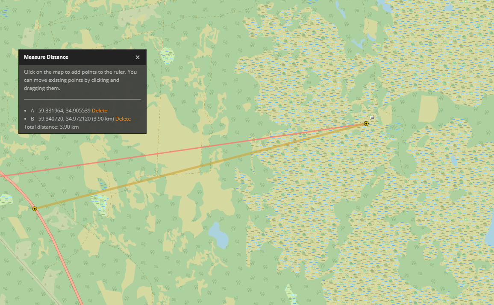

Ближайшая дорога:

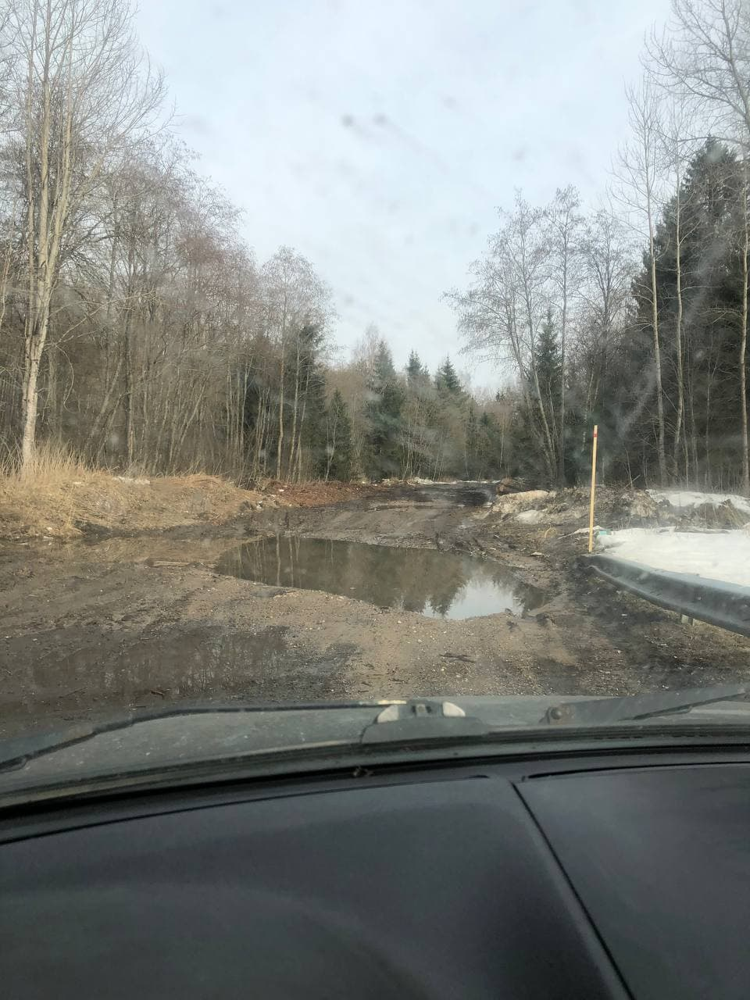

Край болота:

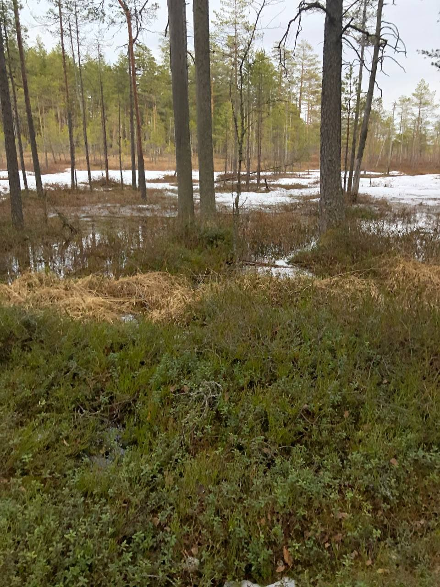

Побродили несколько часов вокруг и, благоразумно не став геройствовать, позвонили мне со словами: ололо, нам нужен вертолет! Явно нужен был план. Соваться туда ногами (болотоходами, снегоступами и прочими средствами бывалых разведчиков) никто не захотел. Вариант - забыть и простить даже не рассматривался.

Вертолет, как водится, не на каждом углу припаркован. Более реалистичный вариант - вездеход! Начали шерстить интернеты, друзей и соцсети. Не скажу, что прям на каждом шагу раздают вездеходы в аренду - в поисках мы провели несколько дней. Наконец вышли на одних ребят, Питерские производители вездеходов, которым нужен был, внезапно, демо-ролик их детища :3 И они согласились предоставить их вездеход с командой, если мы оплатим им сутки работы видеографа (так они его назвали). Чтож, из альтернатив был только другой вездеход, но почти вдвое дороже. Так что мы начали соглашаться. Ребята подготовили свой вездеход (все это время поисковый трекер передавал статусные сигналы раз в сутки, так что мы были вполне спокойны: его не украли медведи и он не утонул) и мы получили вот это:

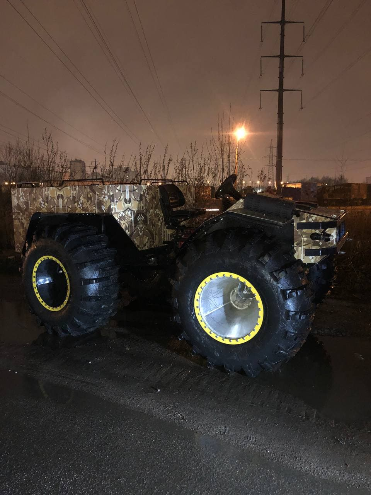

Согласитесь - выглядит, как то что надо!

Не буду вставлять фотки с катанием на нем по болотам, лучше в конце прикреплю видео ;-) Итог этих покатушек, как вы понимаете, весьма успешен. Вот наш короб, открытый сразу после того, как мы его подобрали:

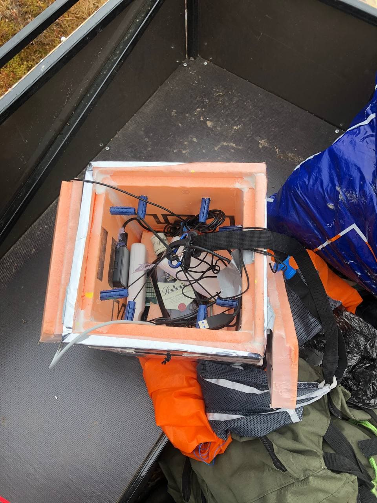

Да, бутылка, с понятной жидкостью, все это время летала вместе с оборудованием. Она там была как презент нашедшему - виски из стратосферы. К счастью, нашедшими оказались мы, так что и презент - нам. Радовались, как дети, чесслово =)

## Результаты

Ну наконец-то. Давайте поговорим о том, что же мы вытащили из болота ценой таких усилий.

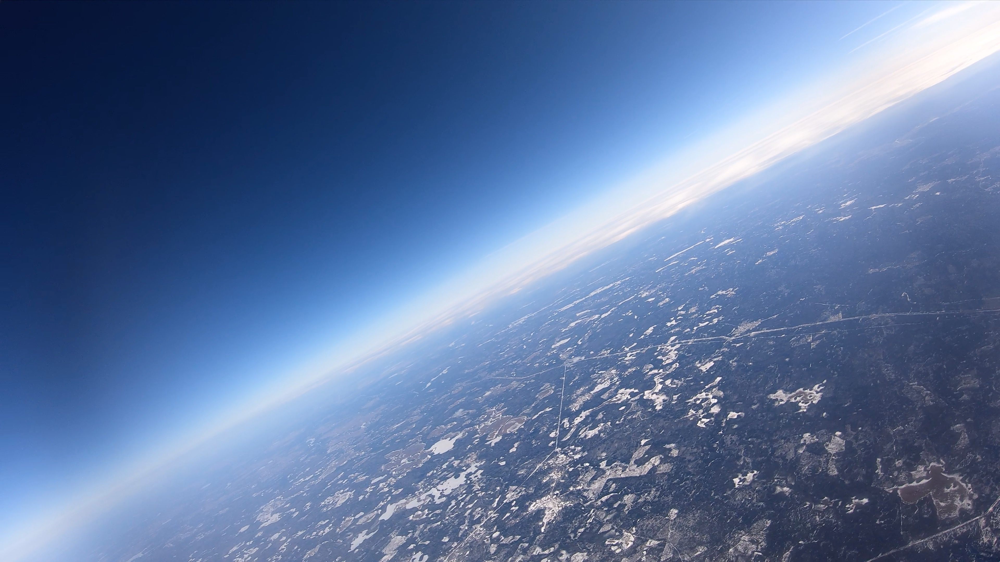

Разумеется все кинулись проверять камеру. Это фото - это один из последних кадров (я выбрал покрасивей) из заснятого видео. Вообще, по расчетам, запаса аккумулятора камеры должно было хватить еще и на приземление и на полежать немного. Но, как видите, не хватило - она записала всего 25 минут видео (4k60fps), из которых 7 на земле перед запуском. Мы строили разные теории почему так произошло. В итоге, поковырявшись уже дома с оборудованием, выяснили: был сломан USB порт на павербанке для камеры. В какой момент он был сломан - неизвестно. Но пока основная версия такова: подключили и включили камеру, *как-то* сломался порт, камера продолжала работать от внутреннего аккумулятора пока он не сел. Из-за внутреннего аккумулятора мы не смогли вовремя распознать поломку, а его запаса, по экспериментам, хватает примерно на 25-30 минут записи.

Когда все остыли, пришло время ковырять показания нашего самописца - он отработал на все 100! И сейчас будет поток графиков построенные по его показаниям. Так как RPI работал долгое время на земле (до и после запуска), я, для удобства анализа, обрезал куски данных с земли.

На шкале X всегда будет время в секундах с момента отрыва от поверхности. Поехали!

График набора высоты по показаниям GPS HAT:

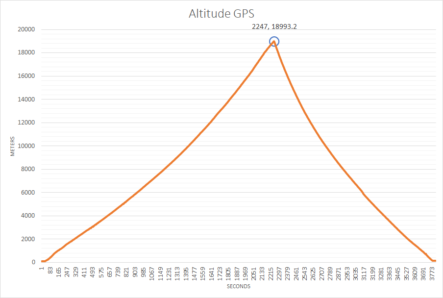

Взгялнув на него, мы видим: максимальная высота, которую он набрал на 2247-й секунде полета, составила 18993 метра над уровнем моря! Это выше чем Эверест, это выше чем летают любые пассажирские самолеты! Но прилично ниже расчетных 30км. Взглянув на то что осталось от, непосредственно, шара, мы предположили, что мы его просто *перекачали* и он взорвался раньше положенного. Была у меня еще версия что мы его *недокачали*. Но тогда бы он повисел на высоте, пока гелий не выйдет и опустился бы целым на землю. А от него ничего не осталось. Значит - перекачали. Учтем на будущее.

Еще по этому графику можно прикинуть - на какой высоте остановилась запись. Приблизительно на 7км. Так что кадр выше примерно с высоты всего 7км.

Раз уж у нас есть показания барометра, забавы ради (практической пользы не несет), я решил рассчитать относительную высоту по барометрической формуле и сравнить эти показания с данными GPS:


Как видим - корреляция есть, отклонения не сказать чтобы пугающие (макс. высота получилась 16183 метра).

Теперь, что же там с давлением?


Мы видим, как падало давление с набором высоты (эффект ожидаемый). Все в той же точке 2247 было зафиксировано минимальное значение - 58 миллибар. Для сравнения - на поверхности было 1050 миллибар. Т.е. всего 5.7% от давления на поверхности!

Как там работал наш кустарный охладитель? Температура внутри бокса:

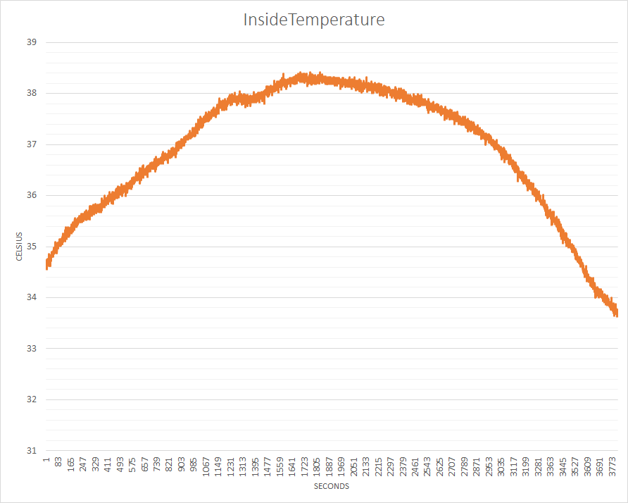

Как видно - скакнула до $38,5^oC$, но это очень далеко от предельной. Так что никто не перегрелся и никто не замерз. Да и в целом - разброс всего 33-35 считаю очень хорошим результатом.

Что в этот момент происходило снаружи? Снова график 2-в-1, чтобы не захламлять картинками:

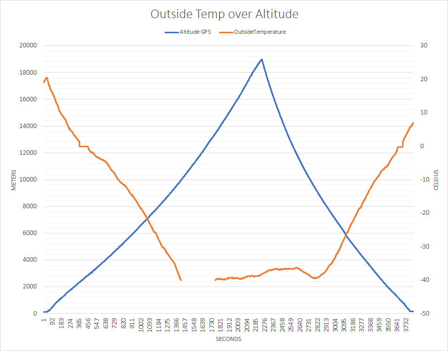

Помните я сетовал на градусник? Вооот. Как видите - провал ниже -40. Значит там было еще холоднее! И второй вывод, который тут можно сделать: **самая холодная точка - не самая высокая!**

Насколько наш климатизатор страдал, можно оценить по графику разницы температур Inside vs Outside:

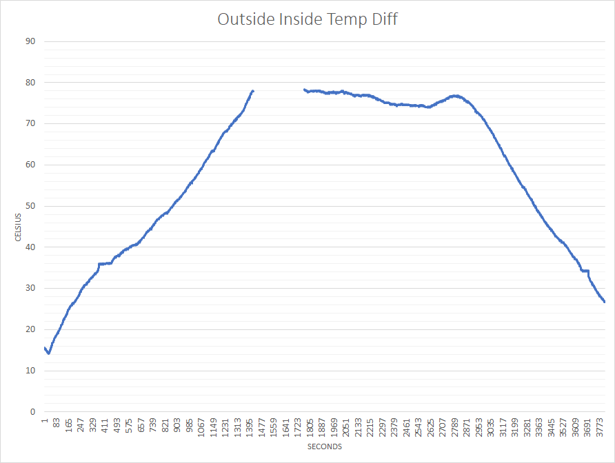

Как видите - разность температур доходила почти до 80! Не сказать что хардкор, но прилично.

Ну и последний на сегодня показатель - влажность:

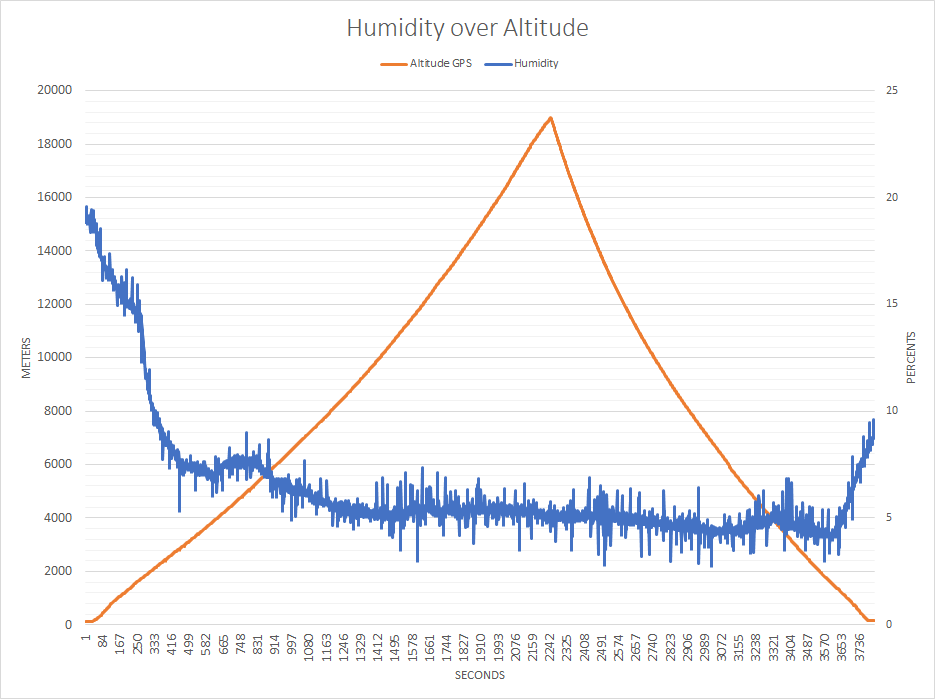

Там довольно сухо, да. Влажность падала до 3%. Ну а откуда ей там взяться?

Хватит графиков. Это, конечно же не все показания, которые записал наш RPI, но статья и так уже слишком разрослась. Так что я оставлю ссылку на полную телеметрию:
- [Оригинал (csv)](telemetry/11042021.csv)
- [Мои изыскания (xlsx)](telemetry/11042021.xlsx)

## Видео

Использование вездехода по назначению:

[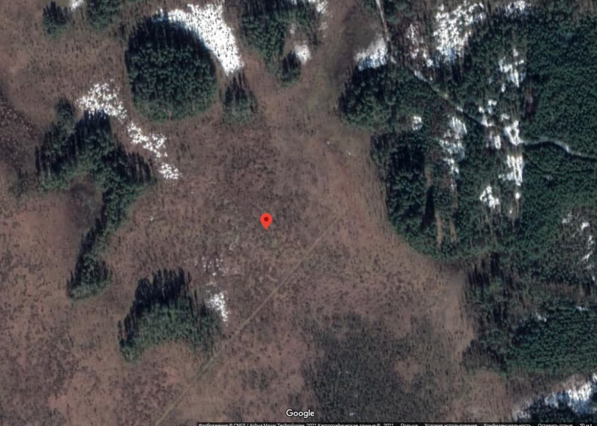](https://youtu.be/NiVsDkOy5xA)

Видео полета с бортовой камеры:

[](https://youtu.be/Bc5jHFEklbA)

## Выводы

Итак, несмотря на то, что расчетная высота достигнута не была: 19км против 30км - все равно считаю, что проект завершился успешно. Тем более, это был первый опыт подобного рода для всех участников проекта. Давайте обозначим технические проблемы, возникшие в процессе этого мероприятия:

- Камера не записала весь полет. 
  - Возможная причина: поломка аккумулятора на запуске.
  - Возможное решение: заменить внешний аккумулятор, удалить внутренний аккумулятор перед запуском (позволит отследить проблему с внешним на ранних этапах)
- Не была достигнута расчетная высота.
  - Возможная причина: перекачали шар. Закачали 1.5 баллона вместо расчетных 1.36
  - Возможное решение: закачать меньше гелия (1.36 баллона)
- Порвался парашют. Не прям в хлам, пара мелких отверстий сбоку. Купол не пострадал и на полетные характеристики это не повлияло. Решение тут только одно - заменить парашют на новый во избежание дальнейшего распространения повреждений.
- Приземление в труднодоступной местности.
  - Причина: ранний взрыв шара
  - Возможное решение: закачать правильное количество гелия. 100% гарантии это не даст, но по итогу, расчетная траектория совпала с реальной, за исключением того, что нагрузка приземлилась раньше положенного времени.

На этом все, всем чистого неба над головой и удачи!