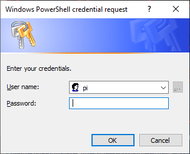

# Название
- [Название](#название)
  - [Список оборудования и компонентов](#список-оборудования-и-компонентов)
  - [Конструкция](#конструкция)
    - [Общая конструкция](#общая-конструкция)
    - [Полезная нагрузка](#полезная-нагрузка)
  - [Raspberry PI 4B](#raspberry-pi-4b)
    - [SD карта для Raspberry PI](#sd-карта-для-raspberry-pi)
    - [Подключаем RPI к компу](#подключаем-rpi-к-компу)
      - [Включаем Wi-Fi на RPI](#включаем-wi-fi-на-rpi)
    - [Сборка .NET Core проекта под RPI](#сборка-net-core-проекта-под-rpi)
  - [CI/CD для Raspberry](#cicd-для-raspberry)
    - [SSH](#ssh)
    - [SFTP](#sftp)
    - [Сборка](#сборка)
    - [Включение\запуск сервисов](#включениезапуск-сервисов)
  - [Отладка в Visual Studio](#отладка-в-visual-studio)
  - [Бюрократия](#бюрократия)

## Список оборудования и компонентов
1. [Raspberry Pi 4 Model B](https://www.raspberrypi.org/products/raspberry-pi-4-model-b/)
2. [SPOT Trace GPS Tracker](https://www.findmespot.com/en-us/products-services/spot-trace)
3. [Шар-зонд](https://airblower.ru/)
4. [Фал (канат)](http://nearspace.ru/)
5. [Парашют](http://nearspace.ru/)
6. Гелий(https://вставить ссылку)
7. GoPro 7 Black (+Micro SD card 128GB)
8. Powerbank x2 (20000 mah)
9. [RPI Sense Hat](https://www.raspberrypi.org/products/sense-hat/)
10. [LTE GPS HAT - LTE / GPRS / GPS SIM7600E-H - for Raspberry - Waveshare 14952](https://botland.com.pl/en/raspberry-pi-hat-connection/12533-lte-gps-hat-lte-gprs-gps-sim7600e-h-for-raspberry-waveshare-14952.html)
11. [TEMPer Gold USB Temperature Sensor](https://thepihut.com/products/temper-gold-original-usb-temperature-sensor)
12. [RPI Tall Case](https://www.amazon.com/anidees-Aluminum-Extra-Raspberry-Model/dp/B07WWPJZKS?th=1)
13. [RPI Mounting Kit](https://www.reichelt.de/raspberry-pi-abstandshalter-sortiment-m2-5-rpi-mountingkit4-p223625.html?r=1)

## Конструкция
### Общая конструкция
Для начала рассмотрим общую конструкцию аппарата (масштаб не соблюден!):

Как вы понимаете, стратосферный зонд это, по факту, шарик (в нашем случае диаметром 2.5м) с полезной нагрузкой на веревке и парашютом. Парашют крепится к нагрузке с помощью вентиляционных отверстий фалом 580мм (подробней в схеме полезной нагрузки). Ну а шар к куполу парашюта тоже фалом (700мм).

Принцип работы прост: с набором высоты атмосферное давление падает и гелий внутри шара начинает этот шар раздувать. В конце концов шар не выдержит растяжения и лопнет. Нагрузка начнет падать и от набегающего потока воздуха раскроется парашют. На парашюте нагрузка плавненько опустится на землю.
### Полезная нагрузка
Конструкция короба для полезной нагрузки вызывала у меня немного больше переживаний. Требовалось соблюсти несколько очень важных условий:
1. Предельная масса не более 2.5кг (для нашего объема шара)
2. Защита от воды + плавучесть (облака, дождь, падение в озеро и т.п.)
3. Хорошая терморегуляция (RPI не должна перегреться, а аккумуляторы не должны замерзнуть)

Посовещавшись с нашим конструкторсим бюро, было решено делать куб со стороной 250мм из экструдированного пенополистирола (куплен в стойтельном магазине листами). Верхняя крышка двустворчатая из того же материала. В боковой стенке вырезано отверстие под объектив GoPro. Он легкий, имеет положительную плавучесть, достаточно прочный и не пропускает воду (швы, разумеется, проклеели):

Теперь рассмотрим компоновку компонентов. Как я сказал, тут главная проблема - терморегуляция. Честно говоря - я не инженер (хотя в дипломе такое слово написано). Так что за правильность решения не ручаюсь, но общими усилиями мы родили такую идею:

RPI располагается внизу. Забортный воздух поступает через вент. отверстия (дюбели, 8 штук) в короб и опускается к RPI. RPI выделяет тепло в процессе своей работы и нагретый воздух поднимается вверх. Тем самым подогревая аккумуляторы, расположенные над RPI.

Вент. отверстия также используются для крепления фала от парашюта:

## Raspberry PI 4B
Сам по себе не представляет никаких проблем, все очень просто и понятно. Это мини-компьютер с портами ввода-вывода к которым мы, в дальнейшем, планируем подключать все наши датчики\сенсоры\велотренажеры.

Скачать [Raspberry PI Imager](https://www.raspberrypi.org/downloads/), выбрать нужную OS, свою SD карту и нажать WRITE:

OS было решено взять максимально облегченную. Десктоп и рюшечки нам не нужны, только консоль, только хардкор 👿 Выбор пал на Raspberry PI OS Lite 32-bit:

### SD карта для Raspberry PI
Хоть в [официальной документации](https://www.raspberrypi.org/documentation/installation/sd-cards.md) толком и не указан максимально допустимый объем карты памяти с которой RPI сможет загрузиться (но указан минимальный - 16GB и, как-то намеками указана возможность загрузки с 256GB с определенного дистрибутива), быстрый гугл показал, что лучше взять 32GB. На этом и остановились. Класс карты не сильно критичен, но разница в цене между Class 4 и Class 10 мне показалась не критичной, так что почему бы не взять ту, что побыстрее? Тем более что это, в дальнейшем, открывает возможность скидывать поток видео с GoPro на карту. Но до этой реализации мы не дошли и, честно говоря, я пока не придумал зачем это надо. Карту взяли **SanDisk Extreme 32GB** типа [такой](https://www.amazon.co.uk/dp/B06XWMQ81P?tag=androcentr-21&ascsubtag=UUacUdUnU77910YYwYg)

### Подключаем RPI к компу
После того как OS записана на карту и карта вставлена в слот на RPI, можно включить RPI просто подав на него питание. Питается это чудо через порт USB-C, так что озаботьтесь проводом заранее (я использовал 1 из повербанков).

Тут у нас первая проблема: ну включили, лампочки замигали, вроде все ОК. 
> И что?

Да, операционку то мы поставили без десктопной оболочки, да и мониторы с клавиатурами мы подключать не планировали, и Wi-Fi там еще не настроен.
Так что я немного присел на стул на полчаса. 

(╯°□°）╯︵ ┻━┻

Честно говоря, бежать в магазин за проводом\переходником mini HDMI у меня не было никакого желания. Снова запускаем гугол и видим, что ситуаци не безвыходная: можно поключить RPI к компу через USB и через него же наладить SSH. И, хотя тот же гугол говорит обратное, RPI при этом будет и питаться от компа и эмулировать сетевое соединение **через один и тот же USB кабель**. Нуштош, вытыкаем наш кабель из павербанка и подлючаем его в USB компа. Снова замигали лампочки, RPI загрузился и, судя по статусу лампочек - у него все отлично.

Но по SSH все еще не подключиться. Курим [вот эту страницу](https://www.raspberrypi.org/documentation/remote-access/ssh/). Нас интересует *headless mode*:

Ага, надо поместить пустой файл с именем `ssh` в корень SD карты. Извлекаем карту из RPI и вставляем ее в комп (предварительно обесточив устройство). Делаем. Пробуем снова. Hostname, User, Password указаны там же, в подразделах для каждой OS. Но, честно говоря, информация там немного устаревшая. Например для Win10 указано, что надо использовать IP вместо имени хоста. Это не так. Забегая вперед, скажу, что и `hostname: raspberrypi.local` тоже заработал без приключений. 

>Интернеты пишут, что для этого необходимо поставить доп. приблуды от Apple, чуть ли не iTunes. Либо опенсорс аналог драйвера для таких доменных имен. Но, как я уже сказал, у меня все заработало и без вот этих вот дел. На всякий случай, вот подробная [статья](https://www.howtogeek.com/167190/how-and-why-to-assign-the-.local-domain-to-your-raspberry-pi/)

Итого. Что мы имеем по подключению по SSH:

`Hostname: raspberrypi.local`

`User: pi`

`Password: raspberry`

Пробуем... не работает. К сожалению у меня не сохранились все скрины этих приключений, ну да ладно, придется поверить мне на слово - не работает.

(╯°□°）╯︵ ┻━┻

Переходим на *нижние интернеты*... Оказывается, мы забыли включить режим **Lan Over Usb** про который я что-то не нашел упоминания в документации (в итоге на офф форумах это им припоминали). Искомая статья (может не именно она, но шаги в ней описаны верные) - [тут](https://learn.adafruit.com/turning-your-raspberry-pi-zero-into-a-usb-gadget/ethernet-gadget)

Итак, если вкратце, нам нужно будет поменять 2 файла на SD карте: `config.txt && cmdline.txt` (могут быть без расширений, я уже не помню). Вынимаем карту из RPI, поключаем к компу, находим первый файл и добавляем в конце строчку `dtoverlay=dwc2`:

Теперь ищем второй файл (`cmdline.txt`). 
>По поводу второго файла небольшое отступление - мне его менять не пришлось - и так все было как надо. Но мало ли ¯\\__(ツ)_/¯ 

Добавляем в него строчку, указывающую на необходимость загрузки нужного модуля ядра (все параметры идут через пробел в одну строчку, это важно!). Скрин из статьи:

Всё, файлы сохранили, карту вставили обратно в RPI, подключаем USB кабель в комп и в порт питания RPI, RPI загружается. Пробуем SSH:

>`ssh pi@rasberrypi.local`

(да, кстати, озаботьтесь наличием SSH клиента на рабочем компе, если вдруг у вас его еще нет)

На этот раз все должно пройти как по маслу (извините, этого скрина тоже не сохранилось). Мы попадем в bash консоль на нашей Rspberry PI 4B по USB и теперь можем наворотить там дел ;-) А первое дело будет - обеспечить себе максимально удобные условия работы, иначе говоря - Wi-Fi!

#### Включаем Wi-Fi на RPI
Тут совсем все просто и без неожиданностей. В RPI OS входит утилита конфигурации через которую можно сделать все (или почти все) что может понадобиться в дальнейшем. Называется она `raspi-config` и ее использование, в частности в контексте настройки *вафли* неплохо описано в официальной документации - [тут](https://www.raspberrypi.org/documentation/configuration/wireless/wireless-cli.md).

Подключаемся по кабелю в SSH сессию нашего *черного ящика*, запускем из консоли:
>`sudo raspi-config` 

Всего несколько клацаний кнопками и можно отсоединять наш USB кабель от компа и подключать его к павербанку (картинки из интернета):

Ну что же, теперь это гораздо больше похоже на независимый бортовой самописец для стратостата, хоть он пока ничего и не самопишет.
> Для удобвства также советую добавить SSH ключи. Надеюсь не надо объяснять как это делать, но если вдруг, то [вот отличный тутор от DigitalOcean](https://www.digitalocean.com/community/tutorials/how-to-set-up-ssh-keys--2) 
### Сборка .NET Core проекта под RPI
Настало время что-нибудь напрограммировать для нашего самописца. Сейчас, прочитав этот подзаголовок, многие могут подумать:

>А почему не питон??

Ну... по нескольким причинам. Во-первых: хваленое комьюнити которое "уже все давно написало, просто подключай и поехали", оказывается не всё написало, а то, что написало, мягко скажем - не едет (об этом в разделе про внешний градусник). А во-вторых: что-бы я не начинал писать - все равно получается C#.

Так что стереотипы прочь - будем ваять *простенький скрипт на шарпе* (зря нам что ли кроссплатформу завозили)! Я буду показывать всё на примере своего проекта для логирования всех показателей. Кто захочет - может использовать свой "hello world", кто не захочет - вот [исходники на гитхабе](https://github.com/ArtemKiyashko/RpiProbeLogger) 

Бытует мнение, что для того, что-бы завести что-то на dotnet, надо для начала этот самый dotnet установить. На самом деле это не так. Dotnet умеет паковать свой CLR в приложение для целевой платформы. Для этого у dotnet cli есть флаг `--self-contained`. Так же нам потребуется указать какой конкретно рантайм мы будем использовать при помощи параметра `-r linux-arm`. Ну и фреймворк укажем, чего уж там. Итого полная команда для сборки самодостаточного dotnet приложения (не требующего установки dotnet runtime на целевую машину) будет выглядеть так:
>`dotnet publish RpiProbeLogger\RpiProbeLogger.csproj --self-contained -r linux-arm -f netcoreapp3.1 -c Release`

На выходе у нас получится исполняемый файл под linux arm со всеми зависимостями. Нам останется только скопировать все содерижимое директории на Raspberry по SSH, сделать файл исполняемым (не обязательно) и, собственно, запустить (подробнее в разделе про CI/CD):
>`chmod +x /home/pi/RpiProbeLogger/RpiProbeLogger`

>`./home/pi/RpiProbeLogger/RpiProbeLogger`

Если кто-то крутит носом от self-contained приложений - ничего страшного, вариант с установкой рантайма и фреймворка (ну мало ли кто-то захочет еще и билдить на распберри) на RPI тоже допустим и прекрасно работает - проверено! Вот [статья](https://edi.wang/post/2019/9/29/setup-net-core-30-runtime-and-sdk-on-raspberry-pi-4) которую я лично использовал (в ходе экспериментов).

## CI/CD для Raspberry
Немного громкое название, но смысл тот-же - приложения мы писать умеем, надо теперь их собирать под целевую платформу и как-то их туда доставлять. Тут нам поможет его величество PowerShell (linux-like товарищи легко заменять его на bash, sh, etc по вкусу. это не принципиально).

Весь скрипт находится в корне репозитория и называется `buildAndDeploy.ps1`. Общий алгоритм такой:

1. Подключиться к RPI по SSH для выполнения команд
2. Установить SFTP сессию для работы с файлами
3. Собрать наше приложение
4. Скопировать билд на RPI
5. Установить и включить сервис нашего приложения (что-бы запускался автоматически при загрузке RPI)

### SSH
Поехали по очереди: с **SSH/SFTP** нам сильно поможет модуль для Powershell - [Posh-SSH](https://github.com/darkoperator/Posh-SSH). На мой взгляд с этим модулем все хорошо, кроме одного - почему-то документацию по нему приходится искать по всему интернету и собирать по крупинкам. Может автор посчитал, что его API и ежу понятно, но вот мне было не очень понятно. Примеры использоввания с описаниями нашлись [тут](https://www.powershellmagazine.com/2014/07/03/posh-ssh-open-source-ssh-powershell-module/). Нас же сейчас инересует установка SSH сессии и делается она вот так:
>`$sshSession = New-SSHSession -Computer raspberrypi.local -Credential $credentials -KeyFile $rsaKeyFile`

Сама сессия сохраняется в переменную `$sshSession`. Обратите внимаение на 2 переменные: `$credentials` и `$rsaKeyFile`: мы же не хотим использовать зашкварные пароли? Мы будем использовать RSA ключи! И как это делать в случае Posh-SSH мне пиршлось поискать. Сначала объясню немного про креденшиалс - в Powershell есть такой командлет `Get-Credential` - он занимается тем, что нативными средствами запрашивает пару логин-пароль у пользователя и возвращает их в качестве объекта:
>`$credentials = (Get-Credential pi)`

В Win10 это выглядит так:

Как вы уже догадались, первым параметром можно сделать пре-ввод логина - pi. Нам это подходит. Теперь тонкий момент про Posh-SSH: он имеет параметр `-KeyFile` куда передается путь до приватного SSH ключа. НО! Приватный ключ может иметь passphrase - а такого параметра Posh-SSH не имеет. Оказывается, и это пришлось поискать, Posh-SSH будет в качестве passphrase использовать пароль из объекта `$credentials` - и это не слишком очевидное поведение, но именно из-за этого и затевалось использование `Get-Credential`. Чтож, этого вполне достаточно, чтобы подключиться по SSH к RPI. Полный скрипт находится в репозитории, а мы вигаемся дальше.

### SFTP
Никаких откровений тут не скрыто, тот же Posh-SSH, те же Credentials, немного другое имя команды:
>`$sftpSession = New-SFTPSession -Computer raspberrypi.local -Credential $credentials -KeyFile $rsaKeyFile`

Сразу укажу команду для копирования файлов (да, всего в одну строчку деплоим, без хитростей):
>`Set-SFTPFolder -SFTPSession $sftpSession -RemotePath '/home/pi/RpiProbeLogger' -LocalFolder "RpiProbeLogger\bin\$($c)\netcoreapp3.1\linux-arm\publish" -Overwrite`

Да, называется она `Set-SFTPFolder`, не спрашивайте почему - я не знаю. Можно догадаться, что копирует она содержимое исходной директории в целевую директорию, а параметр `-Overwrite` указывает что содержимое целевой директории будет перезаписано в случае совпадения имен файлов. Параметры `-RemotePath` и `-LocalFolder` ясны без пояснений. Единственное, что может привлечь внимание - `$($c)` - это передача параметра командной строки, который содержит тип сборки: *Release* или *Debug*. Он так же используется в следующем пункте - сборке приложения.

### Сборка
Итак, как уже было описано в разделе про сборку .net под arm - наша команда сборки будет выглядеть следующим образом:

>`dotnet publish RpiProbeLogger\RpiProbeLogger.csproj --self-contained -r linux-arm -f netcoreapp3.1 -c $c`

Единственная разница тут - это параметр `$c` который мы будем подставлять из параметров командной строки (Release, Debug, etc) - на самом деле можно и не параметризовывать это, а захардкодить "Release" - на любителя.

### Включение\запуск сервисов
Все тот же Posh-SSH имеет еще одну полезную команду: `Invoke-SSHCommand`. С помощью нее мы выполним установку `systemctl` сервиса. Unix-like ребятам тут делать нечего, для остальных немного пролью свет что это.

`systemctl` - это системная служба для управления службами (да-да). Она запускается автоматически и запускает, останавливает, управляет пользовательскими службами основываясь на специальных файлах - `.service`. Такой файл присутсвтует и у меня в репозитории в подпапке с проектом - `probelogger.service` и вот его содержимое:
>[Unit]
>
>Description=Probe Logger Service
>
>[Service]
>
>User=root
>
>WorkingDirectory=/home/pi
>
>ExecStart=/home/pi/RpiProbeLogger/RpiProbeLogger
>
>ExecReload=/bin/kill -HUP $MAINPID
>
>KillMode=process
>
>Restart=on-failure
>
>Type=exec
>
>StandardOutput=syslog
>
>StandardError=syslog
>
>SyslogIdentifier=RpiProbeLogger
>
>[Install]
>
>WantedBy=multi-user.target

Я не буду врать, говоря что мне тут понятно абсолютно все, но, в основном это читается как-то так: 
1. запускать службу от пользователя `root` (да, секурность - не секурность, я понимаю. но рут привелегии потребовались для чтения данных с порта USB. Об этом позже)
2. рабочая директория - такая-то
3. запускать - тот-то файл
4. для перезапуска сервиса в случае катастрофы использовать команду `kill`
5. перезапускать в случае падения
6. логи сохранять в `syslog`

Далее пара команд Posh-SSH. Включение сервиса (означает что он будет запускаться автоматически при запуске RPI):
>`Invoke-SSHCommand -Command 'sudo systemctl enable /home/pi/RpiProbeLogger/probelogger.service' -SSHSession $sshSession`

Немедленный запуск сервиса (не обязательно же перезапускать RPI для нашего логгера, мы же не драйвера пишем):
>`Invoke-SSHCommand -Command 'sudo systemctl start probelogger.service' -SSHSession $sshSession`

Переменная `$sshSession` нам знакома из раздела про SSH сессию - это именно та самая сессия. Файл `probelogger.service` - в репозитории.

Чтож, на этом пожалуй все, что касается билда и доставки нашего самописца на RPI. Напоминаю, весь powershell-скрипт - в корне репозитория (`buildAndDeploy.ps1`). Не совсем автоматизировано - запускать нужно ручками, но вполне себе "continuous" - билди хоть после каждого коммита. Можно было бы конечно поднять pipeline на основе этого на каком-нибудь Azure DevOps или кто что любит (благо выбор сейчас из десятка платформ присутсвует), но я посчитал это оверкилом для таких задач. Побилдим руками, не сломаемся.

Команда билда и деплоя выглядит вот так:
>`.\buildAndDeploy.ps1 -enableService -runService`

По умолчанию билдится *Debug* версия (нам же для разработки и отладки надо). Можно добавить параметр `-c=Release` если необходимо собрать финальную версию.

## Отладка в Visual Studio
## Бюрократия
